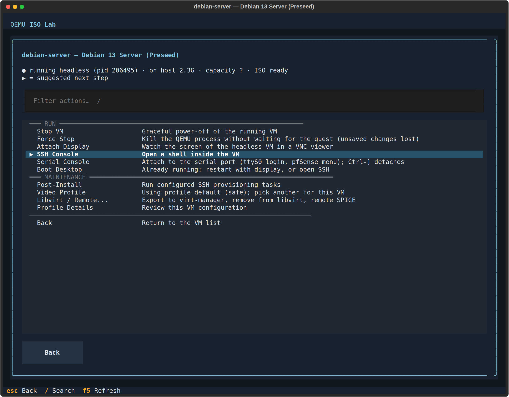
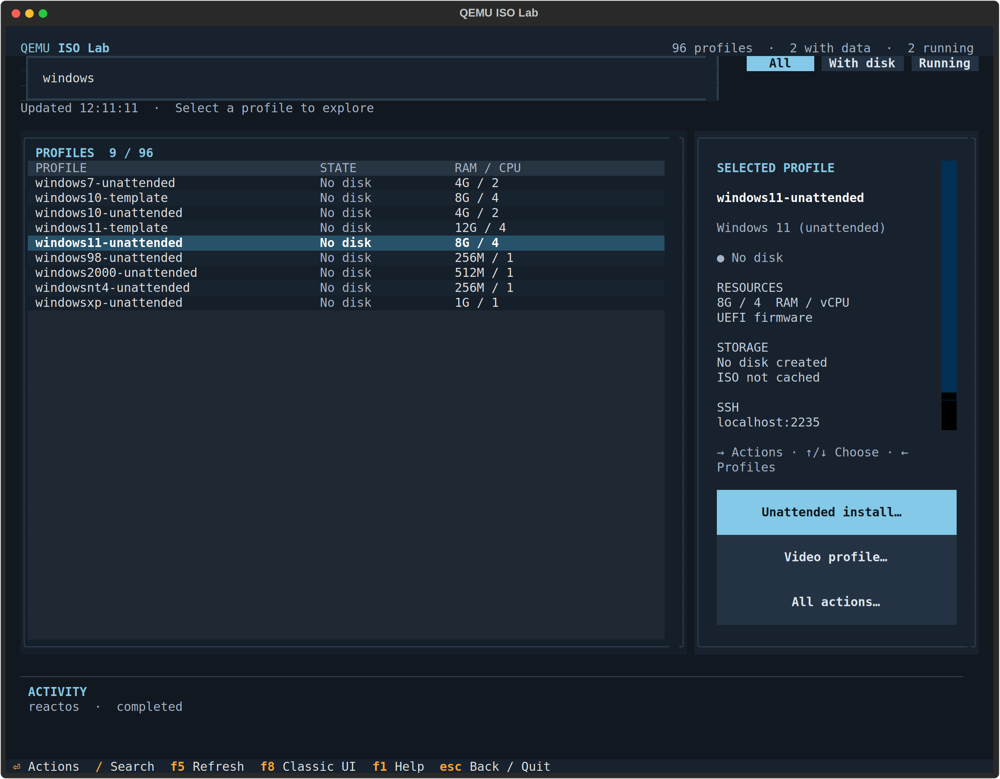

# QEMU ISO Lab

[](https://github.com/manzolo/qemu-iso-lab/actions/workflows/ci.yml)

Install and run **Linux, BSD and Windows** guests on QEMU/KVM from one JSON
profile each: ISO download and checksum, disk, firmware, a **zero-click
install** and SSH provisioning. 96 profiles, from Arch, Debian, Fedora, NixOS
and every Ubuntu LTS since 8.04 to Windows 11, 10, 7, XP, 2000 and NT 4,
FreeBSD, pfSense and ReactOS. One CLI (`vmctl`) and one terminal dashboard
(`vmtui`) drive all of it.


## Quick start

Host packages (Arch or Debian/Ubuntu):

```bash
sudo pacman -S qemu-desktop qemu-base edk2-ovmf python openssh libvirt make dialog fzf cloud-image-utils xorriso virtiofsd virt-viewer p7zip dvd+rw-tools python-bcrypt swtpm gdisk ddrescue partclone util-linux
sudo apt install -y qemu-system-x86 qemu-utils ovmf python3 openssh-client libvirt-clients libvirt-daemon-system make dialog fzf cloud-image-utils xorriso virtiofsd virt-viewer p7zip-full dvd+rw-tools python3-bcrypt swtpm gdisk gddrescue partclone fdisk
```

```bash
git clone https://github.com/manzolo/qemu-iso-lab.git && cd qemu-iso-lab
make install-cli                        # vmctl and vmtui into ~/.local/bin
vmctl setup                             # checks qemu, OVMF, KVM and the helpers
make install                            # installs what setup reported missing (or: make install growisofs xorriso)

vmctl bootstrap-preseed debian-server   # Debian, zero clicks, ~10 minutes
vmctl shell debian-server               # SSH into it
```

The dashboard needs [Textual](https://textual.textualize.io/) (optional):

```bash
make install textual                    # .venv-tui with Textual, no sudo
vmtui                                   # without Textual: the fzf/dialog menus
```

Tab completion: `echo 'eval "$(vmctl completion zsh)"' >> ~/.zshrc` (bash works too).

## What it installs

`vmctl list` prints every profile with its status and last live verification.
Unattended flows run headless on a serial console, then boot the installed disk
and run the profile's SSH provisioning.

| Family | Examples | Zero-click install |
|--------|----------|--------------------|
| Ubuntu and flavours | 8.04 → 26.04 desktops, Kubuntu, Xubuntu, Lubuntu, MATE, Budgie, Cinnamon, Studio, niri | `bootstrap-unattended` (autoinstall), `bootstrap-preseed` (d-i, up to 18.04) |
| Debian / Kali | server, GNOME, KDE, Xfce, Kali | `bootstrap-preseed` |
| Fedora / RHEL | Workstation, KDE, Silverblue, Kinoite, AlmaLinux, Rocky, CentOS Stream | `bootstrap-kickstart` |
| Arch family | Arch + niri/DMS/Noctalia, CachyOS, Omarchy, pearOS, NVIDIA recipes | `bootstrap-archinstall`, `bootstrap-omarchy`, `bootstrap-pearos` |
| Others | openSUSE Tumbleweed, NixOS, Alpine, FreeBSD, Void | `bootstrap-autoyast`, `bootstrap-nixos`, `bootstrap-alpine`, `bootstrap-freebsd` |
| **Windows** | 11, 10 (OpenSSH, virtio drivers, virtiofs share), 7 | `bootstrap-windows` |
| **Windows retro** | XP, 2000, NT 4.0, 98 | `bootstrap-windowsxp`, `bootstrap-windows2000`, `bootstrap-windowsnt4`, `bootstrap-windows98` |
| Network lab | pfSense router + Pi-hole + Lubuntu client on an isolated LAN | `vmctl lab install` |
| ReactOS | 0.4.16 | `bootstrap-reactos` |

Windows media have no public URL: put your own ISO in `isos/` (retro keys go in
`local.json`). Every profile also offers a manual install:
`vmctl provision <vm>` boots the ISO on a fresh disk.

## Everyday commands

| I want to... | Run |
|--------------|-----|
| see the VMs and their state | `vmctl list`, `vmctl status`, `vmctl show <vm>` |
| boot, enter, stop | `vmctl start <vm>` (`--headless --background`), `vmctl shell <vm>`, `vmctl stop <vm>` |
| watch a headless VM, also mid-install | `vmctl attach <vm>` (VNC), `vmctl console <vm>` (serial) |
| keep a copy to go back to | `vmctl checkpoint create <vm> clean`, then `restore` ([guide](docs/CHECKPOINTS.md)) |
| make an independent second VM | `vmctl clone <vm> <new-name>` ([guide](docs/CLONE.md)) |
| hand a VM to virt-manager | `vmctl export-libvirt <vm>` ([guide](docs/LIBVIRT.md)) |
| write to a USB disk, or import one | `vmctl flash`, `vmctl import-device` ([guide](docs/IMPORT_DISKS.md)) |
| validate the install flows | `vmctl check-vms --group smoke --restore --report --open` |
| free space | `vmctl clean <vm>`, `vmctl delete-iso <vm>` |

Every command accepts `--dry-run`; `vmctl --help` lists them all by task.

## The TUI

`vmtui` shows every profile with its live state. Right or Enter moves to the
selected VM's actions: install before there is a disk, boot after, display, SSH
and stop while it runs. **All actions…** opens the full menu, grouped and
filterable, with the suggested next step preselected. Every action runs a
`vmctl` command, and the dashboard shows the command line so you can copy it.



`/` searches names, descriptions and families, so `windows` lists every
Windows profile:



F8 (or `vmtui --classic`) opens the fzf/dialog menus, which also hold the
tools and the network lab. Controls, video profiles and remote SPICE:
[docs/VMTUI.md](docs/VMTUI.md).

## Make it yours

Tracked profiles use a generic guest user `lab` (password `lab`). Your identity,
SSH key, dotfiles and extra commands go in the git-ignored
`vms/profiles/local.json`, deep-merged over every profile:

```bash
make init-local-profile && $EDITOR vms/profiles/local.json
```

See [docs/PROVISIONING.md](docs/PROVISIONING.md).

## Documentation

[docs/README.md](docs/README.md) is the map. The main pages:
[PROFILES](docs/PROFILES.md) (the profile model, adding a VM) ·
[UNATTENDED](docs/UNATTENDED.md) (every install flow) ·
[PROVISIONING](docs/PROVISIONING.md) ·
[VMTUI](docs/VMTUI.md) ·
[NETWORK-LAB](docs/NETWORK-LAB.md) ·
[IMPORT_DISKS](docs/IMPORT_DISKS.md) ·
[ARCHITECTURE](docs/ARCHITECTURE.md) ·
[DEVELOPMENT](docs/DEVELOPMENT.md).
Printable step-by-step guides in English and Italian are in
[docs/guides/](docs/guides/README.md) (`make guides` builds the PDFs).

## Development

```bash
make check          # mypy --strict + tests, before every push
make validate-vms   # local only: reinstall every unattended profile, HTML report (hours)
make help           # every developer target
```

The `Makefile` holds developer targets only; user-facing behaviour is a `vmctl`
subcommand. Tests never touch the host. `.claude/commands/` has Claude Code
shortcuts for this checkout (`/vm-status`, `/vm-unattended`, `/vm-ssh`, `/vm-shot`, ...).
