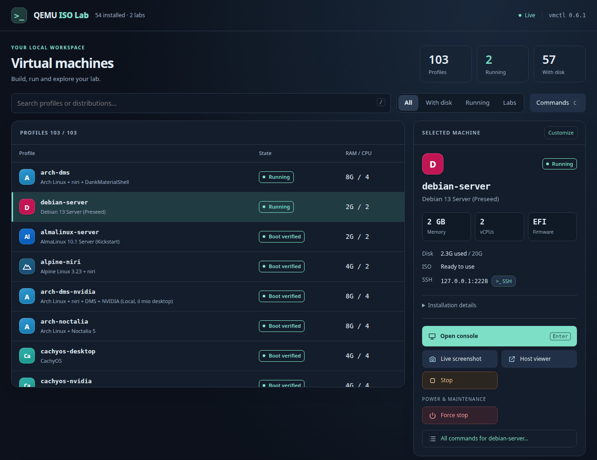
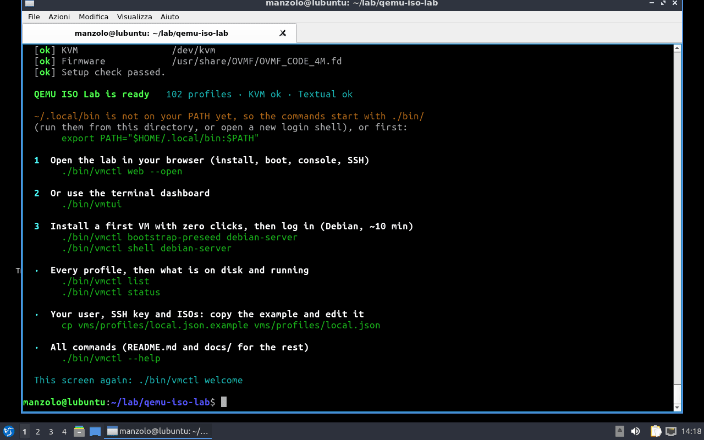
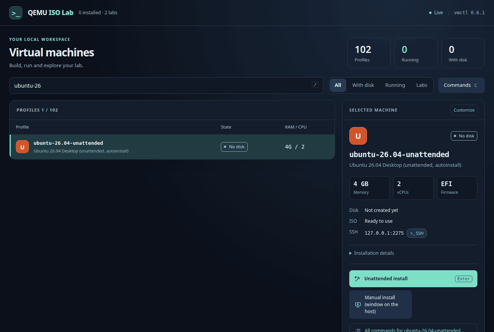
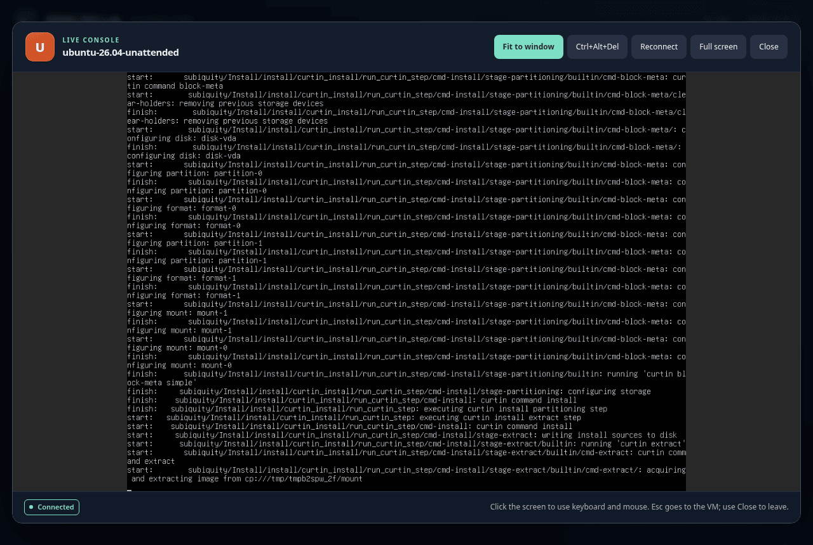
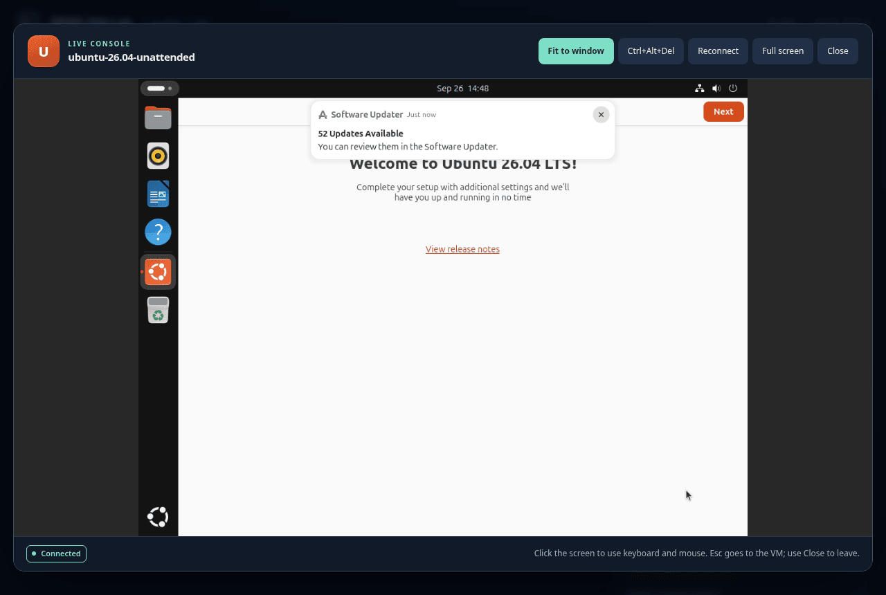
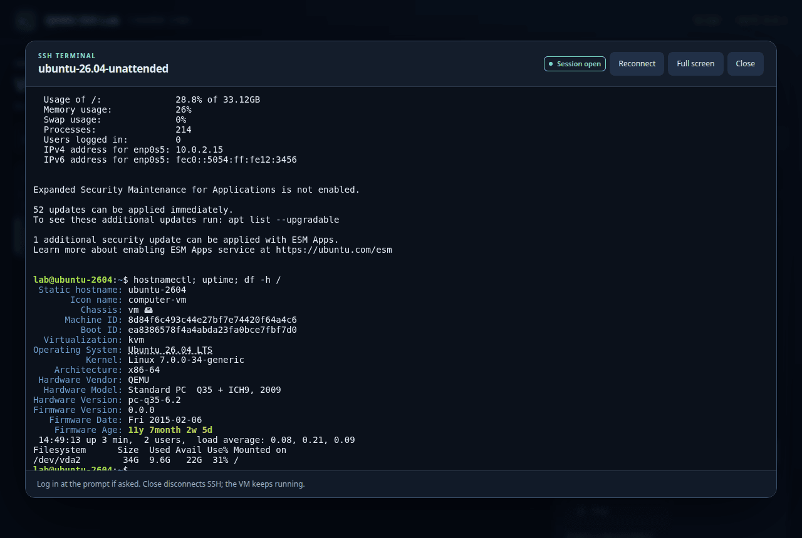
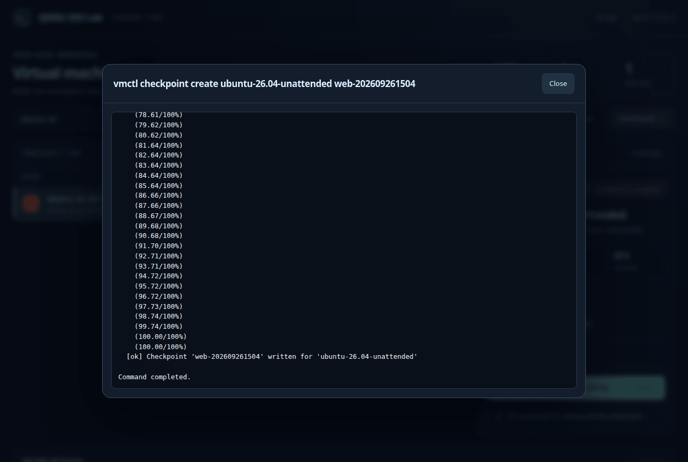
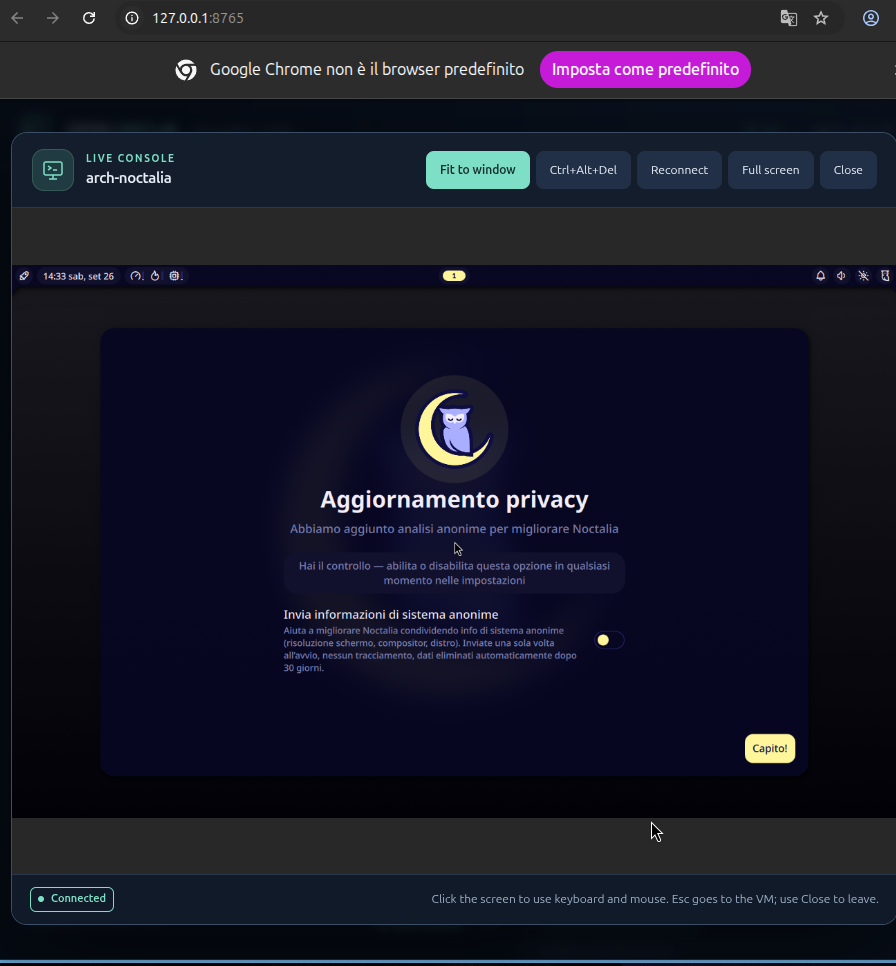
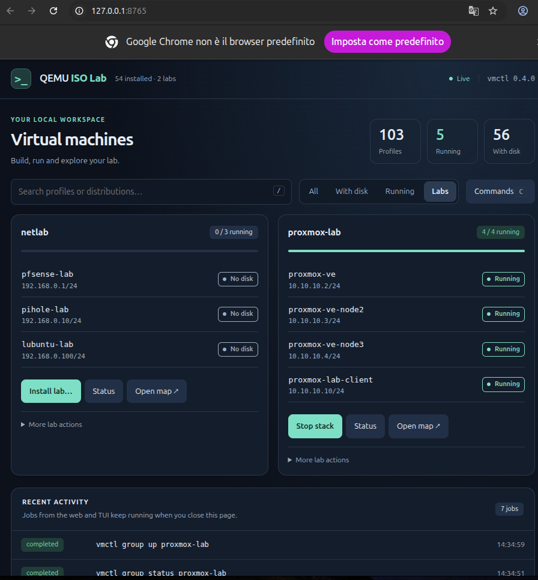
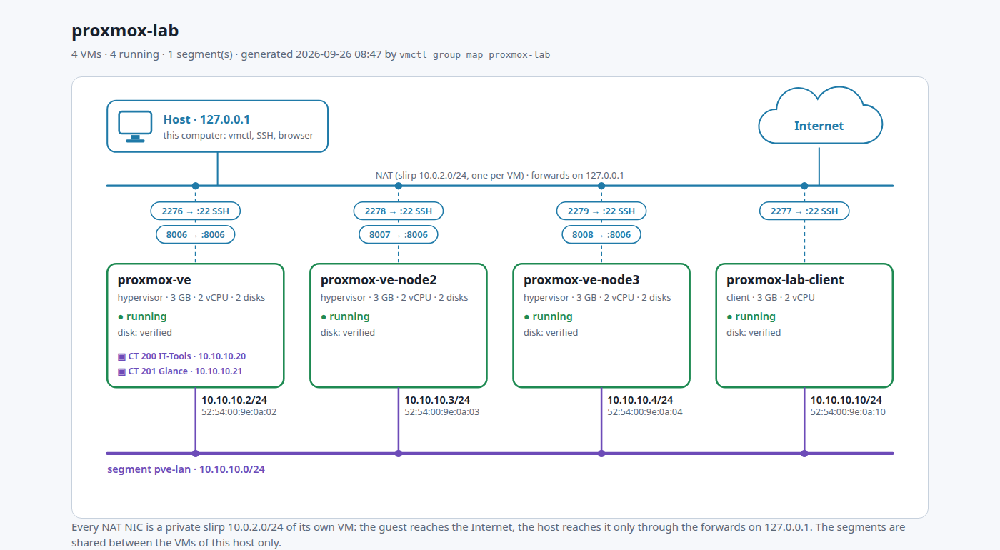

# QEMU ISO Lab

[](https://github.com/manzolo/qemu-iso-lab/actions/workflows/ci.yml)


**Linux, BSD and Windows virtual machines on QEMU/KVM, installed with zero clicks.**
One JSON profile per VM describes the ISO (downloaded and checksummed), the
disk, the firmware, the unattended install and the SSH provisioning. Manage it
from the **web dashboard** (`vmctl web`), the terminal dashboard (`vmtui`) or the
CLI (`vmctl`), all sharing the same profiles, VM state and jobs.

- **101 profiles**, 56 of them fully unattended: every Ubuntu LTS since 8.04, Debian,
  Fedora, Arch, NixOS, openSUSE, FreeBSD, ReactOS and Windows from 11 back to NT 4.
- **Labs**: groups of VMs on a private network, installed and started as one stack,
  such as a pfSense + Pi-hole network or a three-node Proxmox VE cluster.
- **In your browser**: live VM screens, interactive SSH, searchable commands,
  job logs and local profile customization, served on 127.0.0.1.
- **Tested for real**: every unattended profile is reinstalled from scratch by a local
  validation matrix; the last full run (2026-09-26) was 53 PASS, 0 FAIL.



**Contents:** [Quick start](#quick-start) · [From zero to a running VM](#from-zero-to-a-running-vm) · [What it installs](#what-it-installs) ·
[In the browser](#in-the-browser) · [Terminal dashboard](#the-dashboard) · [Labs](#labs) · [Everyday commands](#everyday-commands) ·
[Make it yours](#make-it-yours) · [Documentation](#documentation) · [Development](#development)

## Quick start

```bash
git clone https://github.com/manzolo/qemu-iso-lab.git && cd qemu-iso-lab
./setup.sh        # links vmctl + vmtui into ~/.local/bin, installs what is missing, checks the host
vmctl web --open  # the browser dashboard: select a profile and install or boot it
```

No `make` needed (a fresh Ubuntu has none): `make web` and `make setup` are just aliases.
If `~/.local/bin` is not in your PATH yet, run `./bin/vmctl web --open`. Prefer a terminal?
`vmtui` is the TUI, `vmctl` the CLI. The dashboard prints a URL with a token; open that URL
if the browser does not open by itself.

`./setup.sh` (or `make setup`) lists what it is about to install and asks first; it
needs only `python3`, which every supported distribution ships, and ends with a welcome
screen listing the first commands (`vmctl welcome` prints it again any time). It uses `apt` or
`pacman` for QEMU, OVMF and the helpers, and puts Textual (the dashboard) in the
repository's `.venv-tui` without sudo. Running it again only installs what is missing.

Or skip the dashboard and go straight to a VM, from an empty disk to a logged-in guest:

| You get | Command | Time |
|---------|---------|------|
| Debian server, over SSH | `vmctl bootstrap-preseed debian-server && vmctl shell debian-server` | ~5 min |
| Arch with niri + Noctalia | `vmctl bootstrap-archinstall arch-noctalia && vmctl start arch-noctalia` | ~7 min |
| Ubuntu 24.04 GNOME | `vmctl bootstrap-unattended ubuntu-gnome-24.04 && vmctl start ubuntu-gnome-24.04` | ~20 min |
| Windows 11 (your ISO in `isos/`) | `vmctl bootstrap-windows windows11-unattended && vmctl start windows11-unattended` | ~30 min |
| A three-node Proxmox cluster | `vmctl group install proxmox-lab` | ~25 min |

Times are from the last validation run on a desktop host with KVM.

<details>
<summary>Installing the host packages by hand</summary>

For other distributions, or to see exactly what `./setup.sh` would run:

```bash
# Arch / CachyOS
sudo pacman -S qemu-desktop qemu-base edk2-ovmf python openssh libvirt make dialog fzf cloud-image-utils xorriso virtiofsd virt-viewer p7zip dvd+rw-tools python-bcrypt swtpm gdisk ddrescue partclone util-linux
# Debian / Ubuntu (Ubuntu 22.04 has no virtiofsd package: ./setup.sh fetches the upstream build)
sudo apt install -y qemu-system-x86 qemu-utils ovmf python3 python3-venv openssh-client libvirt-clients libvirt-daemon-system make dialog fzf cloud-image-utils xorriso virtiofsd virt-viewer p7zip-full dvd+rw-tools python3-bcrypt swtpm gdisk gddrescue partclone fdisk

make install textual    # only the dashboard, into .venv-tui (or name any tool: make install xorriso)
vmctl setup             # check again (-v: one line per tool)
```

Only `qemu-system-x86_64`, `qemu-img`, `python3` (3.10 or newer) and the OVMF
firmware are required; every other tool serves one flow, and `vmctl setup` says
which. Without Textual, `vmtui` opens the classic fzf/dialog menus.
</details>

<details>
<summary>On Windows: inside WSL2</summary>

vmctl needs Linux (KVM, `/proc`, Unix sockets), so on Windows 11 it runs inside a WSL2
distribution, which gets `/dev/kvm` through nested virtualization. `setup-windows.ps1` does
it all: it installs WSL and Ubuntu 24.04 if missing, turns nested virtualization on in
`.wslconfig`, clones the repository inside Ubuntu, runs `./setup.sh` there and adds you to the
`kvm` group. Download [`setup-windows.ps1`](setup-windows.ps1) and, in PowerShell:

```powershell
powershell -ExecutionPolicy Bypass -File .\setup-windows.ps1       # run it again after a reboot it asks for
powershell -ExecutionPolicy Bypass -File .\setup-windows.ps1 -Web  # the dashboard, opened in the Windows browser
```

By hand it is `wsl --install -d Ubuntu-24.04`, then the Quick Start above in the Ubuntu shell.
WSL forwards localhost, so the dashboard works in the Windows browser at the printed
`http://127.0.0.1:8765/?token=…` URL; windows of
*Boot with display* appear through WSLg. Flashing or importing a physical disk needs the disk
attached to WSL first (`wsl --mount`, from an administrator PowerShell). This setup has not
been through the validation matrix yet: reports are welcome.
</details>

## From zero to a running VM

A complete lifecycle in screenshots, shot on a clean Lubuntu 22.04: `git clone`, `./setup.sh`, then
an Ubuntu 26.04 desktop downloaded, installed unattended, used through the browser console and SSH,
checkpointed and stopped, all from the buttons of the web page, with the equivalent command for each step.

| | | |
|:-:|:-:|:-:|
| [](docs/FIRST_VM.md#2-set-up-the-host) | [](docs/FIRST_VM.md#5-download-the-iso) | [](docs/FIRST_VM.md#7-watch-the-install) |
| setup ends with the next commands | download, then install unattended | watch the install in the page |
| [](docs/FIRST_VM.md#8-use-the-desktop) | [](docs/FIRST_VM.md#9-ssh) | [](docs/FIRST_VM.md#10-save-it-stop-it) |
| the desktop, in the browser | SSH, in the browser or on the host | checkpoint and stop |

**[Read the step-by-step guide](docs/FIRST_VM.md)** · [download it as a PDF](docs/FIRST_VM.pdf) (14 pages)

## What it installs

| Family | Profiles | Unattended with |
|--------|----------|-----------------|
| Ubuntu and flavours | every LTS desktop from 8.04 to 26.04, Kubuntu, Xubuntu, Lubuntu, MATE, Budgie, Cinnamon, Studio | `bootstrap-unattended`, `bootstrap-preseed` |
| Debian, Kali | server, GNOME, KDE, Xfce, Kali | `bootstrap-preseed` |
| Fedora, RHEL | Workstation, KDE, Silverblue, Kinoite, AlmaLinux, Rocky, CentOS Stream | `bootstrap-kickstart` |
| Arch family | Arch with niri, DMS or Noctalia, CachyOS, Omarchy, pearOS, NVIDIA recipes | `bootstrap-archinstall`, `bootstrap-omarchy`, `bootstrap-pearos` |
| More Linux | openSUSE Tumbleweed, NixOS, Alpine | `bootstrap-autoyast`, `bootstrap-nixos`, `bootstrap-alpine` |
| BSD and others | FreeBSD, pfSense, ReactOS, Proxmox VE, Haiku | `bootstrap-freebsd`, `bootstrap-pfsense`, `bootstrap-reactos`, `bootstrap-proxmox`, `bootstrap-haiku` |
| Windows | 11 and 10 (OpenSSH, virtio drivers, shared folder), 7 | `bootstrap-windows` |
| Windows retro | XP, 2000, NT 4.0, 98 | `bootstrap-windowsxp`, `bootstrap-windows2000`, `bootstrap-windowsnt4`, `bootstrap-windows98` |

An unattended install runs headless on a serial console, boots the installed disk
and runs the profile's SSH provisioning. Every profile also has a manual install:
`vmctl provision <vm>` boots the ISO on a fresh disk. `vmctl list` shows each
profile's status and the date of its last live verification.

`vmctl` downloads and checksums every ISO that has a public source, archives
included (ReactOS's zip, pfSense's `.iso.gz`). Where there is none (Windows, whose
download links expire; the retro versions, which need your own media and key; pearOS's
signed links), `vmctl fetch-iso <vm>` and the dashboard ("ISO needed") say exactly
what to get and where to put it.

## The dashboard

`vmtui` lists every profile with its live state. Enter runs the suggested action for
the selected VM: install it when there is no disk, boot it when there is one, open
its display while it runs. The panel on the right has the other actions, and
**All actions…** the full menu. Every action is a `vmctl` command, shown so you
can copy it.

- `/` searches names, descriptions and families; **All**, **With disk**, **Running**
  and **Labs** (F2) filter the list.
- **Tools… (F4)**: status of everything, remote hosts, and **Clean All** (asks first).
- F8, or `vmtui --classic`: the fzf/dialog menus, for terminals without Textual.


Keys, video profiles and remote SPICE: [docs/VMTUI.md](docs/VMTUI.md).

## In the browser

```bash
vmctl web --open          # open the dashboard on 127.0.0.1:8765
vmctl web --port 9000     # a different port (no browser; the URL with the token is printed)
make web [PORT=9000]      # the same, for those who have make
```

The web dashboard brings the catalog, VM controls and guest access into one page.
It runs locally with Python's standard library; the URL printed at startup carries
the access token.

| From the dashboard | What you can do |
|--------------------|-----------------|
| **Profiles** | Search and filter by state, inspect RAM/CPU/disk, and install, boot or stop a VM. Right-click a row for its actions. |
| **Live console** | Use the guest's screen, keyboard and mouse in the browser, with fit/actual-size, reconnect and full screen. |
| **SSH** | Open an interactive terminal in the browser or on the host, or copy the connection command. |
| **Commands** | Browse suggestions and recent commands, filter by category, edit parameters, then copy or run the preview. |
| **Customize** | Change RAM, CPU or other JSON settings in a local override, keeping the catalog as a template. |
| **Labs** | Install a new lab or start an installed stack, inspect its members and open its network map. |
| **Recent activity** | Follow job output live; jobs are shared with the TUI and keep running when you close the page. |

Choose **Boot headless**, then **Open console** to interact with a desktop without
opening a separate QEMU window. The same console lets you watch unattended installs.



Use `/` to search profiles, `C` to open commands and **Ctrl/Cmd+Enter** to run a
reviewed command. Destructive commands ask for confirmation. Physical-disk **Flash** and
**import-device** pick the target disk from a list and open in a terminal window on the host,
where sudo asks for your password and the CLI asks its questions.

The graphical console and browser SSH terminal load noVNC/xterm.js from a CDN;
the dashboard and screenshot view need no external assets. After updating the code,
restart `vmctl web` and open its newly printed URL to load new API features.

Details, shortcuts, local overrides and API: [Web dashboard guide](docs/WEB.md).

## Labs

A lab is a group of VMs on a private network segment, installed and started as one
stack. Each lab gets a generated network map with addresses, port forwards,
logins and a step-by-step runbook.

| Lab | What is in it | Install |
|-----|---------------|---------|
| `netlab` | pfSense router, Pi-hole DNS, Lubuntu desktop client | `vmctl group install netlab` |
| `proxmox-lab` | three Proxmox VE nodes clustered over ZFS mirrors, a Debian client with a browser | `vmctl group install proxmox-lab` |

In the web dashboard, choose **Labs** to see each stack's members, addresses and live state.
Start or stop the stack from its card, or right-click an individual VM for its actions.





Members, commands and both maps: [docs/LABS.md](docs/LABS.md).

## Everyday commands

| I want to... | Run |
|--------------|-----|
| see the VMs and their state | `vmctl list`, `vmctl status`, `vmctl show <vm>` |
| boot, enter, stop | `vmctl start <vm>`, `vmctl shell <vm>`, `vmctl stop <vm>` |
| watch a headless VM, even mid-install | `vmctl attach <vm>` (screen), `vmctl console <vm>` (serial) |
| keep a copy to go back to | `vmctl checkpoint create <vm> clean`, later `restore` ([guide](docs/CHECKPOINTS.md)) |
| make an independent second VM | `vmctl clone <vm> <new-name>` ([guide](docs/CLONE.md)) |
| open a VM in virt-manager | `vmctl export-libvirt <vm>` ([guide](docs/LIBVIRT.md)) |
| write a VM to a USB disk, or import one | `vmctl flash`, `vmctl import-device` ([guide](docs/IMPORT_DISKS.md)) |
| free space | `vmctl clean <vm>`, `vmctl delete-iso <vm>` |

Every command accepts `--dry-run`, and `vmctl --help` lists them all by task.
Tab completion: `echo 'eval "$(vmctl completion zsh)"' >> ~/.zshrc` (bash works too).

## Make it yours

In the web dashboard, select a VM and choose **Customize** (also available by
right-clicking its row). Set RAM and vCPUs, or expand **Advanced JSON override**
for other fields. Changes are validated and saved in `vms/profiles/local.json`,
with a backup; the catalog files stay unchanged. **Restore catalog values** removes
that VM's override. Resource changes take effect at the next start.

Tracked profiles use a generic guest user, `lab` with password `lab`. Your user
name, SSH key, dotfiles and extra commands go in `vms/profiles/local.json`, which
git ignores and which is merged over every profile:

```bash
make init-local-profile && $EDITOR vms/profiles/local.json
```

Details: [docs/PROVISIONING.md](docs/PROVISIONING.md).

## Documentation

| Page | Read it for |
|------|-------------|
| [docs/README.md](docs/README.md) | the map of every page, in reading order |
| [PROFILES](docs/PROFILES.md) | the profile model, and how to add a VM |
| [UNATTENDED](docs/UNATTENDED.md) | how each unattended install works, and the validation matrix |
| [PROVISIONING](docs/PROVISIONING.md) | your identity, packages and dotfiles in a fresh guest |
| [VMTUI](docs/VMTUI.md) | the dashboard and the classic menus |
| [FIRST_VM](docs/FIRST_VM.md) ([PDF](docs/FIRST_VM.pdf)) | from `git clone` to a running Ubuntu desktop, every screen of the lifecycle |
| [WEB](docs/WEB.md) | the lab in a browser: actions, jobs, API, safety |
| [LABS](docs/LABS.md) | the network lab and the Proxmox lab |
| [guides/](docs/guides/README.md) | printable step-by-step guides in English and Italian (`make guides`) |

## Development

```bash
make check          # mypy --strict + every test (the dashboard's too), before each push
make validate-vms   # local only: reinstall every unattended profile, HTML report (hours)
make help           # every developer target
```

The `Makefile` holds developer targets only; anything a user runs is a `vmctl`
subcommand. Tests never touch the host, and CI runs them on Python 3.10 to 3.14.
More in [docs/DEVELOPMENT.md](docs/DEVELOPMENT.md) and [docs/ARCHITECTURE.md](docs/ARCHITECTURE.md).
