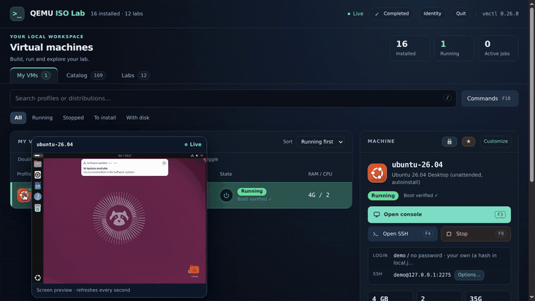

# QEMU ISO Lab

[](https://github.com/manzolo/qemu-iso-lab/actions/workflows/ci.yml)


[](https://manzolo.github.io/qemu-iso-lab/)
[](https://manzolo.github.io/qemu-iso-lab/tour.html)

**Pick an OS. Spin up a VM. Build your own lab.**

Linux, BSD and Windows on QEMU/KVM, with **100+ ready-made profiles** and unattended
installs for more than half of them. Manage everything from a browser, a terminal
dashboard or the CLI: the same profiles, machines and jobs, whichever you prefer.

**[Browse the catalog](https://manzolo.github.io/qemu-iso-lab/)** ·
**[Watch the tour](https://manzolo.github.io/qemu-iso-lab/tour.html)** ·
**[Your first VM](docs/FIRST_VM.md)**

[](https://manzolo.github.io/qemu-iso-lab/tour.html)

*▶ [Watch QEMU ISO Lab in four minutes](https://manzolo.github.io/qemu-iso-lab/tour.html) (narrated, English and Italian) · more screenshots in the [gallery](docs/GALLERY.md)*

[Quick start](#quick-start) · [Explore](#explore) · [Interfaces](#choose-your-interface) ·
[Labs](#labs) · [Customize](#make-it-yours) · [Docs](#documentation) · [Contribute](#development)

## Quick start

**Linux** — paste this into a terminal with `curl` installed:

```sh
sh -c "$(curl -fsSL https://manzolo.github.io/qemu-iso-lab/install.sh)"
```

The [installer](install.sh) clones into `~/qemu-iso-lab` and runs `setup.sh`, which
lists the host tools it needs and asks before installing them. It also adds
**QEMU ISO Lab** to your applications menu.

**Windows 11** — [download and run the installer](https://manzolo.github.io/qemu-iso-lab/install-windows.cmd).
It sets up WSL2 + Ubuntu in three runs, guiding you through the restart and setup.
The same from PowerShell: `irm https://manzolo.github.io/qemu-iso-lab/install.ps1 | iex`.
See the [Windows instructions](docs/INSTALL.md#windows-11) for unsigned-script prompts and requirements.

Open **QEMU ISO Lab** from your applications menu or Windows desktop, then:

1. Pick a profile from **Catalog** and add it to **My VMs**.
2. Choose **Install** and follow the job log.
3. Open the VM's **Console** or **SSH** when it is ready.

Nothing is downloaded until you install a VM. Public ISOs are downloaded and
checksummed; for Windows and other local-only media, **ISO needed** tells you what to supply.

**[Full setup guide](docs/INSTALL.md)** · **[First VM walkthrough](docs/FIRST_VM.md)** ([PDF](docs/FIRST_VM.pdf))

<details>
<summary><b>Prefer the command line? Start with a Debian server.</b></summary>

After setup, install the guest and connect over SSH:

```sh
vmctl bootstrap-preseed debian-server
vmctl shell debian-server
```

Allow about five minutes on a desktop host with KVM. The bootstrap installs the guest
on a fresh disk; back up an existing VM before reinstalling it.
More recipes and daily commands: [Quick reference](docs/QUICK_REFERENCE.md).

</details>

## Explore

| Try something new | What you will find |
|---|---|
| **A desktop or server** | Ubuntu and its flavours, Debian, Fedora, Arch, NixOS, openSUSE, FreeBSD and more. |
| **A trip back in time** | Older Linux releases, Windows from 11 back to NT 4, ReactOS, Haiku and hobby systems. |
| **A repeatable experiment** | Checkpoints, independent clones and ephemeral sessions that discard changes. |
| **A look before installing** | Searchable catalog cards with profile history and recordings of real unattended installs. |

**[Find a profile](https://manzolo.github.io/qemu-iso-lab/)** · **[See the gallery](docs/GALLERY.md)**

## Choose your interface

| Interface | Launch | Highlights |
|---|---|---|
| **[Web dashboard](docs/WEB.md)** | `vmctl web --open` | Live screens, SSH, file transfer, job logs and commands as forms. |
| **[Terminal dashboard](docs/VMTUI.md)** | `vmtui` | Search, live status and contextual actions; `--classic` for fzf/dialog menus. |
| **[Command line](docs/QUICK_REFERENCE.md)** | `vmctl --help` | Install, start, stop, clone and automate directly from your shell. |

The web dashboard serves locally on `127.0.0.1:8765`; `vmctl web --lan` enables
HTTPS access from your network. Closing its terminal stops the dashboard, while VMs keep running.

## Labs

Build a stack of VMs on a private network, with **guided exercises, tests, reset points,
a live network map and a packet inspector**. Guides are available in English and Italian.

| Explore | Labs |
|---|---|
| Networks and security | pfSense + Pi-hole + desktop (`netlab`), SSH, VPN |
| Containers and clusters | Docker, Kubernetes, Proxmox |
| Development and data | Git, MySQL |
| Storage | LVM, software RAID, ZFS |

Open **Labs** in either dashboard, or run `vmctl group list --labs` to choose a stack.
You can also connect any two VMs with `vmctl link kali debian-server`.

**[Explore the labs](docs/LABS.md)** · **[Watch the lessons](https://manzolo.github.io/qemu-iso-lab/tour.html)**

## Make it yours

The first web launch asks for your guest identity; tracked profiles default to `lab` / `lab`.
Use **Customize** to change RAM, CPUs or profile settings. Your identity, overrides and
**My VMs** selection live in `vms/profiles/local.json`, which Git ignores.

**[Personalize guests](docs/PROVISIONING.md)** · **[Create a profile](docs/PROFILES.md)** ·
**[Update the lab](docs/INSTALL.md#updating)** with `vmctl update`.

## Documentation

| I want to… | Read |
|---|---|
| Install and run my first VM | [Setup](docs/INSTALL.md) · [Walkthrough](docs/FIRST_VM.md) |
| Find a command or install recipe | [Quick reference](docs/QUICK_REFERENCE.md) · [Unattended installs](docs/UNATTENDED.md) |
| Save, duplicate or export a VM | [Checkpoints](docs/CHECKPOINTS.md) · [Clones](docs/CLONE.md) · [libvirt](docs/LIBVIRT.md) |
| Work with physical disks | [Flash and import](docs/IMPORT_DISKS.md) |
| Follow a printable guide | [English and Italian guides](docs/guides/README.md) |

**[All documentation →](docs/README.md)**

> [!WARNING]
> **Back up before destructive operations.** `vmctl flash` erases the entire physical
> target disk: verify its size, model and serial first. `import-device` reads a physical
> disk into a VM image. Installs, `clean`, checkpoint restores and lab resets can delete
> or replace VM data. Read the [disk guide](docs/IMPORT_DISKS.md) before working with physical devices.

## Development

Run `make check` for type checks and tests, `make site` to build the catalog, and
`make help` for all targets. The local VM validation matrix reinstalls unattended
profiles from scratch; see the [development guide](docs/DEVELOPMENT.md) and
[architecture overview](docs/ARCHITECTURE.md) before contributing.

## License

[MIT](LICENSE) — provided as is, without warranty. Use at your own risk.
