# QEMU ISO Lab

[](https://github.com/manzolo/qemu-iso-lab/actions/workflows/ci.yml)


[](https://manzolo.github.io/qemu-iso-lab/)
[](https://manzolo.github.io/qemu-iso-lab/tour.html)

**Linux, BSD and Windows virtual machines on QEMU/KVM, installed with zero clicks.**
One JSON profile per VM describes the ISO (downloaded and checksummed), the disk, the
firmware, the unattended install and the SSH provisioning. Pick the profiles you want out
of the catalog and manage them from the **web dashboard** (`vmctl web`), the terminal
dashboard (`vmtui`) or the CLI (`vmctl`), all sharing the same profiles, VM state and jobs.
New here? **[The tour](https://manzolo.github.io/qemu-iso-lab/tour.html)** shows the whole road in six short clips,
with English and Italian voice and subtitles: the catalog, the setup, a first VM, the console in the browser, a lab, your own lab.

- **100+ profiles**, more than half of them fully unattended: every Ubuntu LTS since 8.04, Debian,
  Fedora, Arch, NixOS, openSUSE, FreeBSD, Haiku, ReactOS and Windows from 11 back to NT 4,
  plus hobby systems to boot and explore (KolibriOS, Redox OS, MenuetOS, SerenityOS).
  Browse them, with a clip of each install, at [manzolo.github.io/qemu-iso-lab](https://manzolo.github.io/qemu-iso-lab/).
- **My VMs**: choose the profiles you care about; the dashboards open on them and nothing is
  downloaded until you install one. Every profile is versioned, with its changelog.
- **Labs**: groups of VMs on a private network, installed and started as one stack (a pfSense +
  Pi-hole network, a three-node Proxmox VE cluster), or any two machines linked on the spot.
- **In your browser**: live VM screens, interactive SSH, searchable commands, job logs and
  local profile customization, served on 127.0.0.1.
- **Tested for real**: every unattended profile is reinstalled from scratch by a local
  validation matrix; the last full run (2026-09-27) passed 60 of 61 rows, the one failure a
  vmctl bug on a disk-image profile (SerenityOS), fixed the next morning.

> [!WARNING]
> **Use at your own risk.** QEMU ISO Lab is provided **as is**, without warranty of any kind
> ([MIT License](LICENSE)): you run it on your machine, with your data, under your responsibility.
> **`vmctl flash` and `vmctl import-device` write directly to physical disks.** `flash` overwrites
> the whole target device: everything on it is **erased and cannot be recovered**. Pick the device by
> its size, model and serial, check it twice, and keep a backup of anything you care about.
> Installs, `clean`, checkpoint restores and lab installs also delete or replace VM disks.

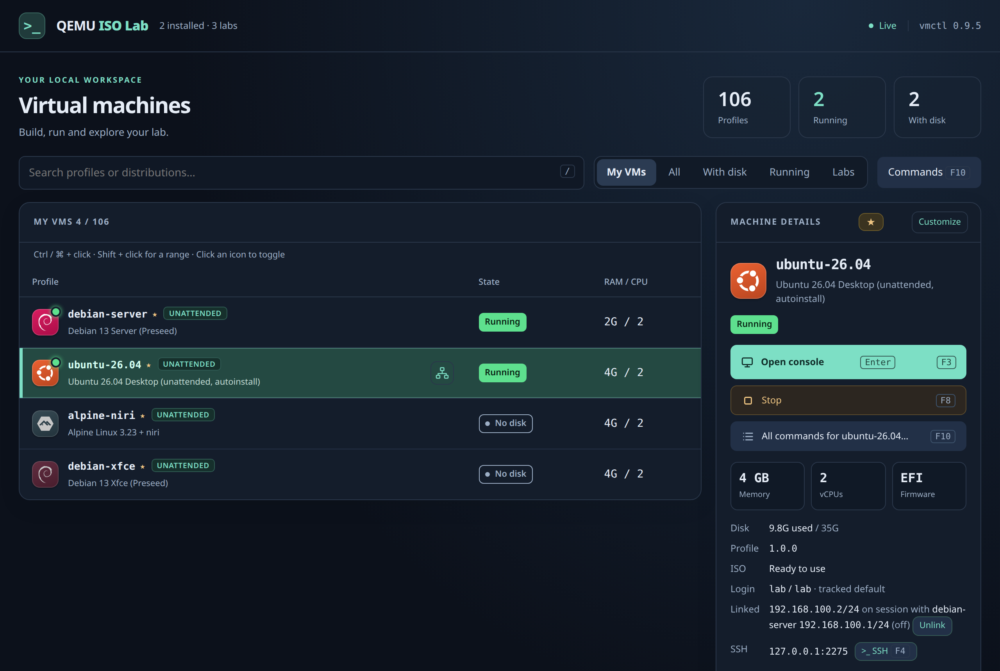

**Contents:** [Quick start](#quick-start) · [From zero to a running VM](#from-zero-to-a-running-vm) · [The catalog](#the-catalog-pick-what-you-want) ·
[In the browser](#in-the-browser) · [Terminal dashboard](#the-terminal-dashboard) · [Labs](#labs) · [Everyday commands](#everyday-commands) ·
[Make it yours](#make-it-yours) · [Documentation](#documentation) · [Development](#development) · [License](#license)

## Quick start

**Linux** — paste this into a terminal (it needs `curl`; the script is [install.sh](install.sh)):

```sh
sh -c "$(curl -fsSL https://manzolo.github.io/qemu-iso-lab/install.sh)"
```

It clones the project into `~/qemu-iso-lab` (`git` and `python3` are installed first if
missing, with apt, pacman, dnf or zypper), runs `setup.sh`, which lists the host tools it would
install and **asks before touching anything**, and adds **QEMU ISO Lab** to your applications
menu plus the `qemu-iso-lab` command to `~/.local/bin`. About two minutes on a host that
already has QEMU. No VM image is downloaded until you choose one.

**Windows 11** — [download the installer](https://manzolo.github.io/qemu-iso-lab/install-windows.cmd)
and open it. It is an unsigned script, so the browser asks whether to keep it (Edge: *Keep*, then
*Open file*) and Windows warns once more: choose **Run** (*Cancel* is the default button). vmctl
needs Linux, so the installer sets up **WSL2 + Ubuntu 24.04** and runs the Linux installer inside;
that takes **three runs**, and each one ends by saying what to do next:

1. installs WSL (accept the administrator prompt), then **restart Windows**;
2. installs Ubuntu and asks you to choose a Linux user name and password;
3. clones the project, runs `setup.sh` in Ubuntu (asks before installing, then wants that
   password for `sudo`) and puts **QEMU ISO Lab** on the desktop and in the Start menu.

The same from PowerShell: `irm https://manzolo.github.io/qemu-iso-lab/install.ps1 | iex`
(the script is [setup-windows.ps1](setup-windows.ps1)). Hardware virtualization must be enabled
in the firmware for KVM.

When setup finishes, open **QEMU ISO Lab** from the applications menu (Linux) or the desktop
(Windows): a terminal window opens and the browser lands on the dashboard. Keep that terminal
open while you use the lab; closing it (or Ctrl-C) stops the dashboard, not the VMs. On Linux
the command `qemu-iso-lab` does the same (`~/qemu-iso-lab/bin/qemu-iso-lab` while `~/.local/bin`
is not on your PATH).

Running the installer again is safe: on Linux it reuses the checkout without pulling or touching
local changes (`VMCTL_INSTALL_DIR=/other/path` installs elsewhere); on Windows it continues
where it stopped.

<details>
<summary><b>Manual installation / already cloned the repository</b></summary>

```bash
git clone https://github.com/manzolo/qemu-iso-lab.git && cd qemu-iso-lab
./setup.sh        # links vmctl + vmtui into ~/.local/bin, installs what is missing, checks the host
vmctl web --open  # the browser dashboard: pick a profile and install or boot it
```

No `make` needed (a fresh Ubuntu has none): `make web` and `make setup` are just aliases.
If `~/.local/bin` is not in your PATH yet, run `./bin/vmctl web --open`. Prefer a terminal?
`vmtui` is the TUI, `vmctl` the CLI. The dashboard prints a URL with a token; open that URL
if the browser does not open by itself.

`./setup.sh` lists what it is about to install and asks first; it needs only `python3`, which
every supported distribution ships, and ends with a welcome screen listing the first commands
(`vmctl welcome` prints it again any time). It uses `apt` or `pacman` for QEMU, OVMF and the
helpers, and puts Textual (the terminal dashboard) in the repository's `.venv-tui` without sudo.
Running it again only installs what is missing.

</details>

Or skip the dashboard and go straight to a VM, from an empty disk to a logged-in guest:

| You get | Command | Time |
|---------|---------|------|
| Debian server, over SSH | `vmctl bootstrap-preseed debian-server && vmctl shell debian-server` | ~5 min |
| Arch with niri + Noctalia | `vmctl bootstrap-archinstall arch-noctalia && vmctl start arch-noctalia` | ~7 min |
| Ubuntu 26.04 desktop | `vmctl bootstrap-unattended ubuntu-26.04 && vmctl start ubuntu-26.04` | ~20 min |
| Windows 11 (your ISO in `isos/`) | `vmctl bootstrap-windows windows-11 && vmctl start windows-11` | ~30 min |
| A three-node Proxmox cluster | `vmctl group install proxmox-lab` | ~25 min |

Times are from the last validation run on a desktop host with KVM.

<details>
<summary><b>Installing the host packages by hand</b></summary>

For other distributions, or to see exactly what `./setup.sh` would run:

```bash
# Arch / CachyOS
sudo pacman -S qemu-desktop qemu-base edk2-ovmf python openssh libvirt make dialog fzf cloud-image-utils xorriso virtiofsd virt-viewer p7zip dvd+rw-tools python-bcrypt swtpm gdisk ddrescue partclone util-linux
# Debian / Ubuntu (Ubuntu 22.04 has no virtiofsd package: ./setup.sh fetches the upstream build)
sudo apt install -y qemu-system-x86 qemu-utils ovmf python3 python3-venv openssh-client libvirt-clients libvirt-daemon-system make dialog fzf cloud-image-utils xorriso virtiofsd virt-viewer p7zip-full dvd+rw-tools python3-bcrypt swtpm gdisk gddrescue partclone fdisk

make install textual    # only the dashboard, into .venv-tui (or name any tool: make install xorriso)
vmctl setup             # check again (-v: one line per tool)
```

Only `qemu-system-x86_64`, `qemu-img`, `python3` (3.10 or newer) and the OVMF
firmware are required; every other tool serves one flow, and `vmctl setup` says
which. Without Textual, `vmtui` opens the classic fzf/dialog menus.
</details>

<details>
<summary><b>On Windows: inside WSL2</b></summary>

vmctl needs Linux (KVM, `/proc`, Unix sockets), so on Windows 11 it runs inside a WSL2
distribution, which gets `/dev/kvm` through nested virtualization. `setup-windows.ps1` does
it all: it installs WSL and Ubuntu 24.04 if missing, turns nested virtualization on in
`.wslconfig`, clones the repository inside Ubuntu, runs `./setup.sh` there and adds you to the
`kvm` group. Use the PowerShell one-liner above, or download
[`setup-windows.ps1`](setup-windows.ps1) and, in PowerShell:

```powershell
powershell -ExecutionPolicy Bypass -File .\setup-windows.ps1       # run it again after a reboot it asks for
powershell -ExecutionPolicy Bypass -File .\setup-windows.ps1 -Web  # the dashboard, opened in the Windows browser
```

By hand it is `wsl --install -d Ubuntu-24.04`, then the Quick Start above in the Ubuntu shell.
WSL forwards localhost, so the dashboard works in the Windows browser at the printed
`http://127.0.0.1:8765/?token=…` URL; windows of *Boot with display* appear through WSLg.
Flashing or importing a physical disk needs the disk attached to WSL first (`wsl --mount`,
from an administrator PowerShell). This setup has not been through the validation matrix yet:
reports are welcome.
</details>

## From zero to a running VM

<details>
<summary><b>A complete lifecycle in screenshots</b>, shot on a clean Lubuntu 22.04: clone, setup, then an Ubuntu 26.04 desktop downloaded, installed unattended, used through the browser console and SSH, checkpointed and stopped, all from the buttons of the web page.</summary>

| | | |
|:-:|:-:|:-:|
| [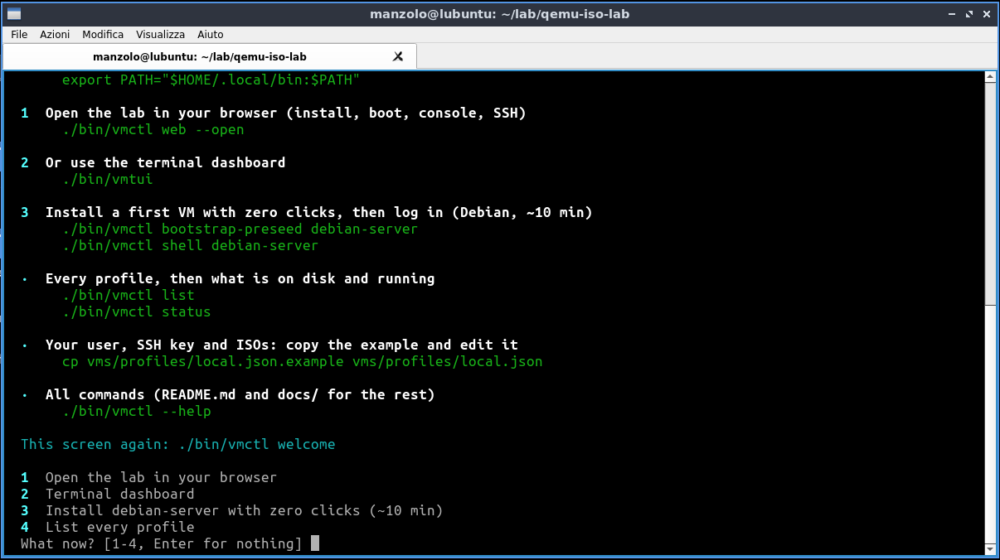](docs/FIRST_VM.md#2-set-up-the-host) | [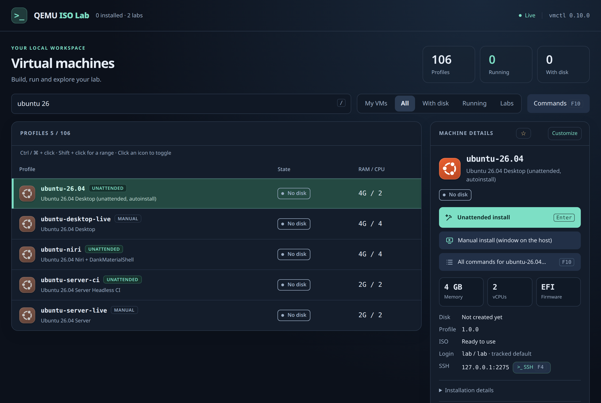](docs/FIRST_VM.md#5-download-the-iso) | [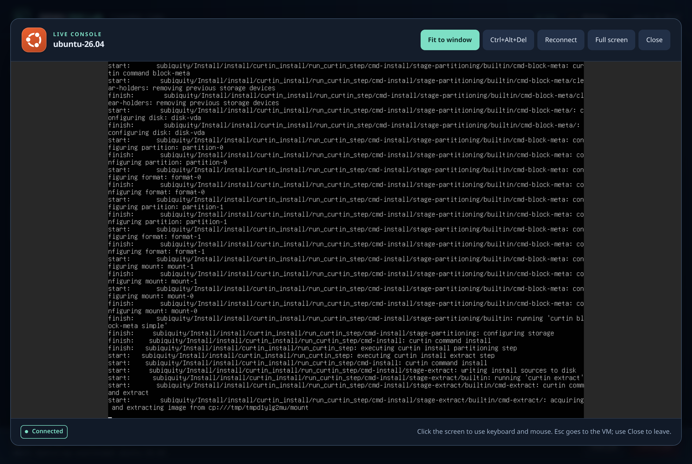](docs/FIRST_VM.md#7-watch-the-install) |
| setup ends with the next commands | download, then install unattended | watch the install in the page |
| [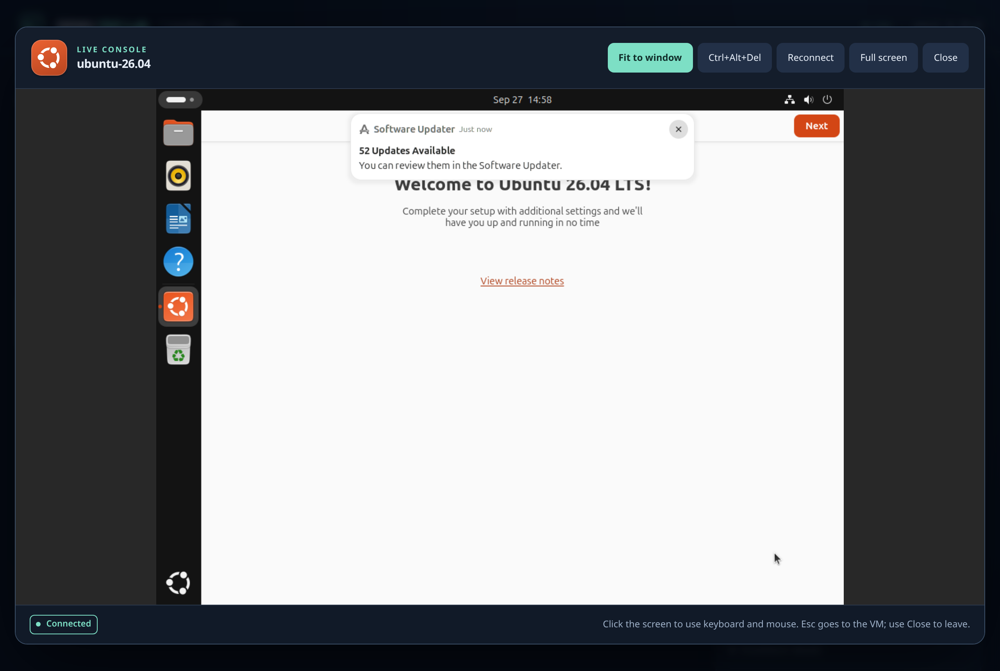](docs/FIRST_VM.md#8-use-the-desktop) | [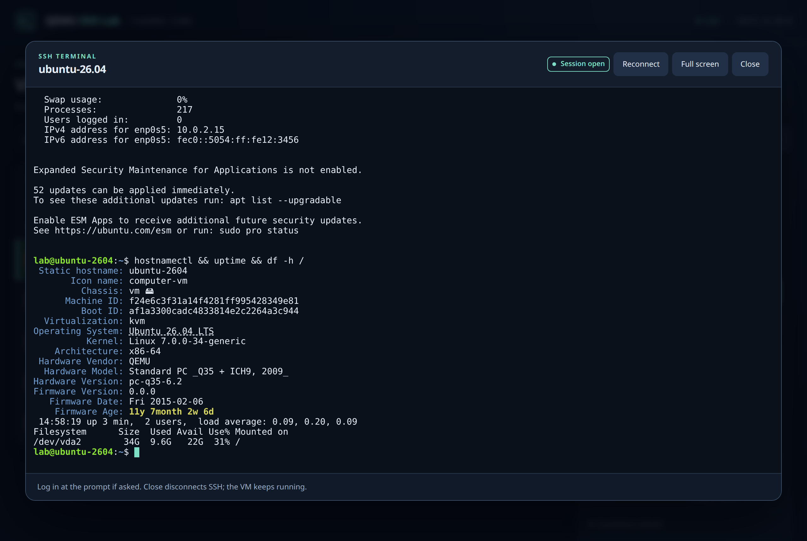](docs/FIRST_VM.md#9-ssh) | [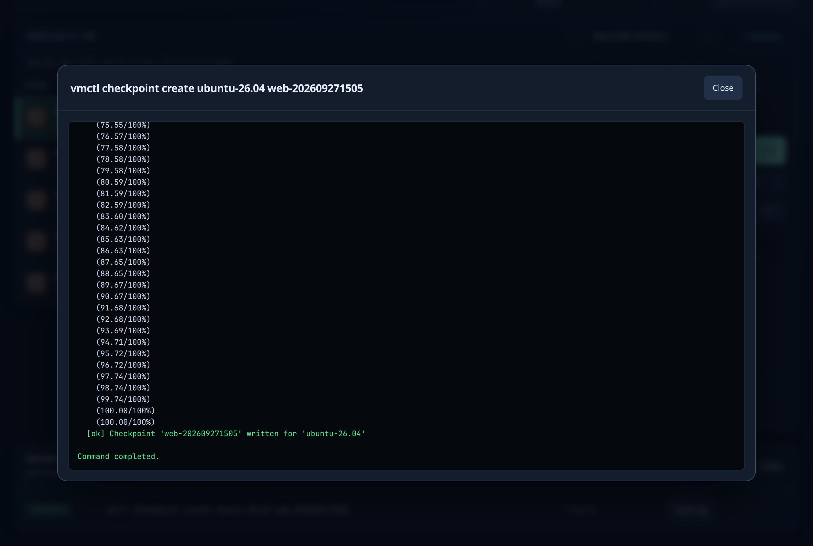](docs/FIRST_VM.md#10-save-it-stop-it) |
| the desktop, in the browser | SSH, in the browser or on the host | checkpoint and stop |

Every step gives the equivalent command, for the terminal or a script.
</details>

**[Read the step-by-step guide](docs/FIRST_VM.md)** · [download it as a PDF](docs/FIRST_VM.pdf) (15 pages)

## The catalog: pick what you want

The catalog is large on purpose; you do not have to look at all of it. Browse it online at
**[manzolo.github.io/qemu-iso-lab](https://manzolo.github.io/qemu-iso-lab/)**: search, filter by
family, kind of install and role, and watch each unattended profile install itself: every card
carries a short clip of a real install, recorded by the validation matrix (`vmctl check-vms
--record`), from the installer to the installed system. Read each profile's version and changelog,
tick the ones you want and copy the resulting line:

```bash
vmctl catalog add ubuntu-26.04 debian-server kali   # or right-click a row → Add to My VMs
vmctl catalog                                       # what is chosen; remove, set, clear
```

From then on both dashboards open on **My VMs** (your choice, plus whatever is running) and the
chosen profiles carry a ★. Nothing is downloaded until you install one.

[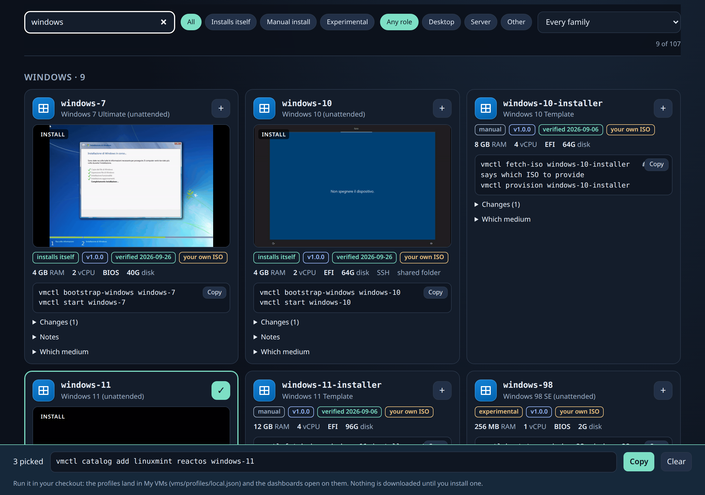](https://manzolo.github.io/qemu-iso-lab/)

Every profile has a version (`meta.version`, `1.0.0` today) and a history of changes; an install
records the version it used, so the dashboards tell you when a disk carries an older recipe than
the catalog. Details: [docs/PROFILES.md](docs/PROFILES.md#profile-versions).

<details>
<summary><b>What it installs</b></summary>

| Family | Profiles | Unattended with |
|--------|----------|-----------------|
| Ubuntu and flavours | every LTS desktop from 8.04 to 26.04, Kubuntu, Xubuntu, Lubuntu, MATE, Budgie, Cinnamon, Studio | `bootstrap-unattended`, `bootstrap-preseed` |
| Debian, Kali | server, GNOME, KDE, Xfce, Kali | `bootstrap-preseed` |
| Fedora, RHEL | Workstation, KDE, Silverblue, Kinoite, AlmaLinux, Rocky, CentOS Stream | `bootstrap-kickstart` |
| Arch family | Arch with niri, DMS or Noctalia, CachyOS, Omarchy, pearOS, NVIDIA recipes | `bootstrap-archinstall`, `bootstrap-omarchy`, `bootstrap-pearos` |
| Linux Mint | 22.3 Cinnamon (Ubiquity in automatic mode) | `bootstrap-ubiquity` |
| More Linux | openSUSE Tumbleweed, NixOS, Alpine | `bootstrap-autoyast`, `bootstrap-nixos`, `bootstrap-alpine` |
| BSD and others | FreeBSD, pfSense, ReactOS, Proxmox VE, Haiku | `bootstrap-freebsd`, `bootstrap-pfsense`, `bootstrap-reactos`, `bootstrap-proxmox`, `bootstrap-haiku` |
| Windows | 11 and 10 (OpenSSH, virtio drivers, shared folder), 7 | `bootstrap-windows` |
| Windows retro | XP, 2000, NT 4.0, 98 | `bootstrap-windowsxp`, `bootstrap-windows2000`, `bootstrap-windowsnt4`, `bootstrap-windows98` |

An unattended install runs headless on a serial console, boots the installed disk
and runs the profile's SSH provisioning. Every profile also has a manual install:
`vmctl provision <vm>` boots the ISO on a fresh disk. `vmctl list` shows each
profile's status, version and the date of its last live verification.

`vmctl` downloads and checksums every ISO that has a public source, archives
included (ReactOS's zip, pfSense's `.iso.gz`). Where there is none (Windows, whose
download links expire; the retro versions, which need your own media and key; pearOS's
signed links), `vmctl fetch-iso <vm>` and the dashboard ("ISO needed") say exactly
what to get and where to put it.
</details>

## In the browser

```bash
vmctl web --open          # open the dashboard on 127.0.0.1:8765
vmctl web --port 9000     # a different port (no browser; the URL with the token is printed)
make web [PORT=9000]      # the same, for those who have make
```

The web dashboard brings the catalog, VM controls and guest access into one page.
It runs locally with Python's standard library; the URL printed at startup carries
the access token.

| From the dashboard | What you can do |
|--------------------|-----------------|
| **Profiles** | Navigate My VMs, Catalog and Labs; filter machines by Running, Stopped, To install or With disk. Runtime state is separate from installation verification. Right-click a row for its actions. |
| **My VMs** | The ★ of a profile adds it to your selection; the page opens on it from then on. |
| **Multiple selection** | Ctrl/Cmd+click or Shift+click several VMs to start, stop, link or unlink them together (F2/F8 act on the selection). |
| **Live console** | Desktop with keyboard shortcuts, clipboard, file upload/download, PNG screenshots, recording, automatic reconnect and docked SSH. Detach consoles to work with several VMs side by side. |
| **VM integration** | Open **Integration** in the live console to inspect connections, download diagnostics, run a confirmed guest command over SSH and review the VM's job history. |
| **SSH** | Open an interactive terminal in the browser or on the host, or copy the connection command. |
| **Link** | Connect two or more VMs on a private network from a machine's network button (click or drag). |
| **Commands** | Browse suggestions and recent commands, filter by category, edit parameters, then copy or run the preview. |
| **Machine details** | Access console/SSH and resources directly; expand Checkpoints, Network, Configuration or Maintenance for other operations. Customize RAM, CPU or JSON settings in a local override. |
| **Labs** | Install a new lab or start an installed stack, inspect its members and open its network map. |
| **Recent activity** | Follow job output live; jobs are shared with the TUI and keep running when you close the page. |

Choose **Start in separate console** (F2) for a desktop: a separate browser window waits
for the VM to start, then opens its console. **Other ways to start** offers an inline
console, background-only start or a QEMU window on the host. Server profiles start in
the background and offer **Open SSH** when running. Multiple selection keeps F2 as a
background start for the selected machines.

A temporary display disconnection shows a central reconnect status. When the server
confirms that the guest has stopped, the console closes automatically (including
separate windows); an active install/start operation continues waiting through guest
restarts. The console also lets you watch unattended installs.

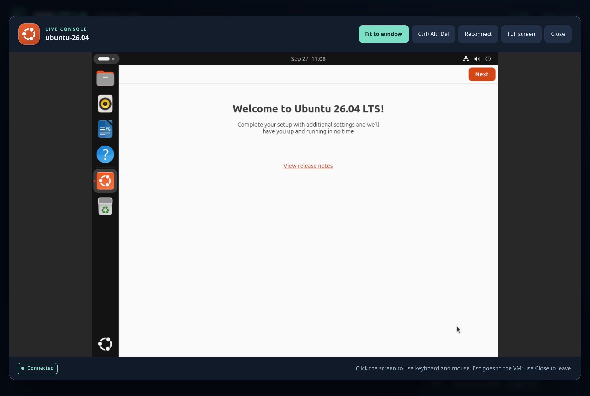

| | |
|:-:|:-:|
| 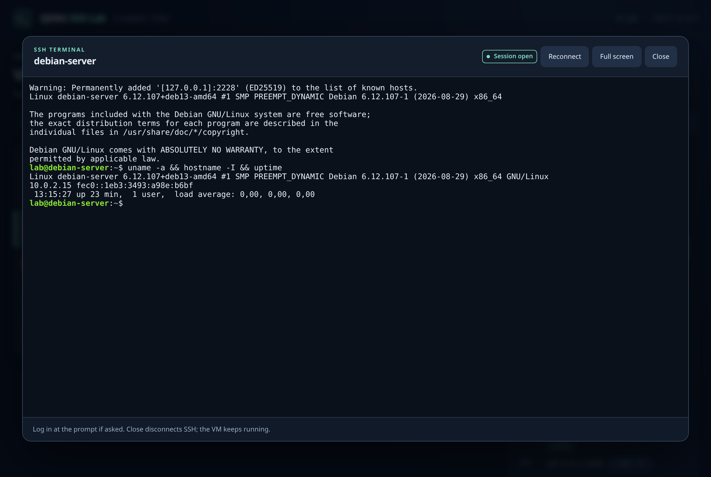 | 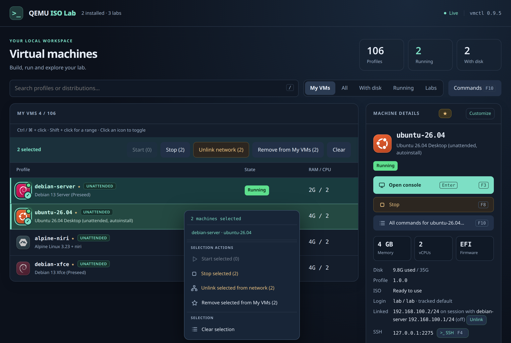 |
| SSH in the browser | multiple selection: start, stop, link, My VMs |
| 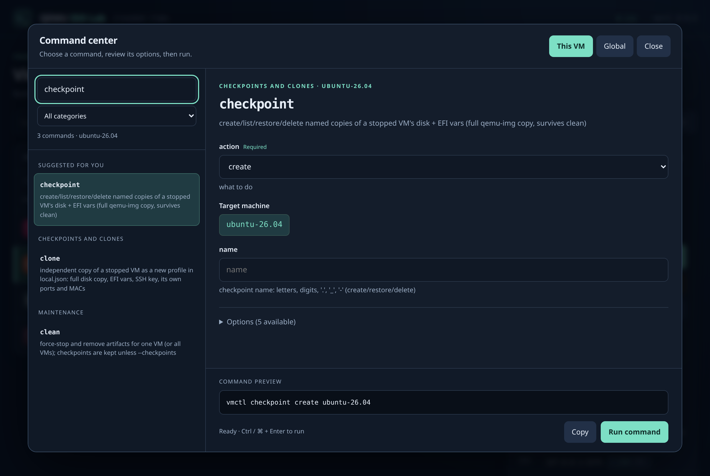 | 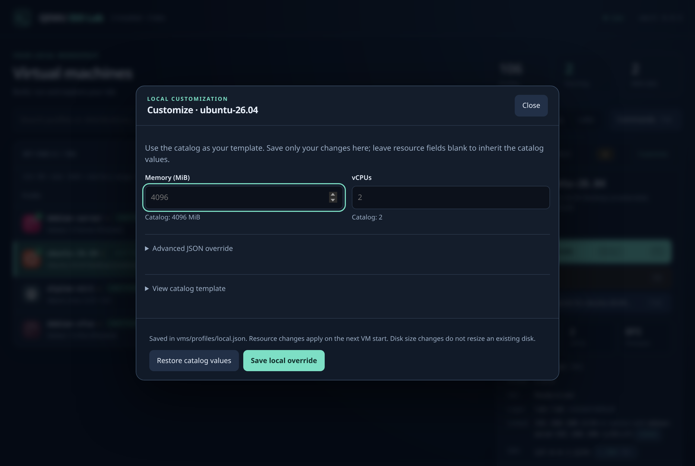 |
| every command as a form (F10) | customize a profile locally |

Use `/` to search profiles, `F10` to open commands and **Ctrl/Cmd+Enter** to run a
reviewed command. Destructive commands ask for confirmation. Physical-disk **Flash** and
**import-device** pick the target disk from a list and open in a terminal window on the host,
where sudo asks for your password and the CLI asks its questions.

Integration checks run only on request and are cached for five seconds. They reuse the console
channel inspection, SSH error classification, guest-agent ping and SFTP; they never wake the
guest or generate SSH keys. A clipboard channel alone is reported as unverified.
Diagnostics use fixed, read-only commands for Windows or the guest's detected init/package
family (including SysV/older APT guests), with a 10-second and 128-KiB output limit per command.
The text download is also saved as `artifacts/<vm>/logs/diagnostics-<UTC timestamp>.txt` and
includes the tails of existing serial logs, even when SSH is unavailable.

Guest commands require confirmation each time and use the existing VM job slot. They record
stdout, stderr and exit status, bounded to 60 seconds and 1 MiB of output. Cancelling one closes
SSH without powering off the VM; a remote process may continue. Previous jobs are retained under
`artifacts/<vm>/runtime/tui-job/history/` and can be opened from **VM command history**.
Multiple file uploads share one SFTP session and run sequentially; each file is limited to
256 MiB, staged under a temporary name, then renamed without replacing existing files.
Use the **×** on a completed recording notice to dismiss it without downloading; **Saved recording**
in the console still opens its download options.

The graphical console and browser SSH terminal load noVNC/xterm.js from a CDN;
the dashboard and screenshot view need no external assets. After updating the code,
restart `vmctl web` and open its newly printed URL to load new API features.

Details, shortcuts, local overrides and API: [Web dashboard guide](docs/WEB.md).

## The terminal dashboard

`vmtui` lists every profile with its live state. Enter runs the suggested action for
the selected VM: install it when there is no disk, boot it when there is one, open
its display while it runs. The panel on the right has the other actions, and
**All actions…** the full menu. Every action is a `vmctl` command, shown so you
can copy it.

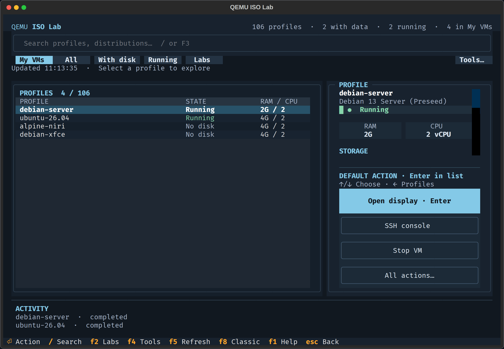

- `/` searches names, descriptions and families; **My VMs**, **All**, **With disk**,
  **Running** and **Labs** (F2) filter the list.
- **Tools… (F4)**: status of everything, remote hosts, and **Clean All** (asks first).
- F8, or `vmtui --classic`: the fzf/dialog menus, for terminals without Textual.

<details>
<summary><b>More screens: the Labs view and the classic menus</b></summary>

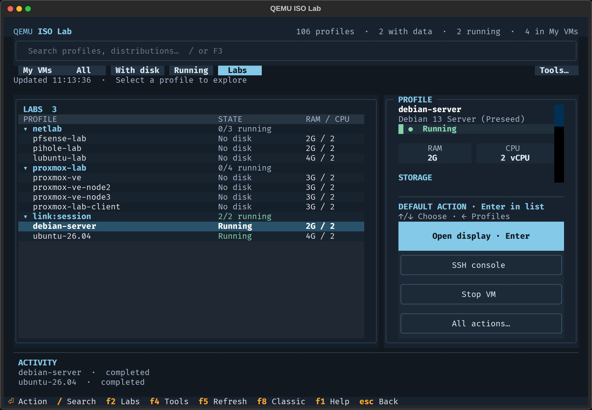

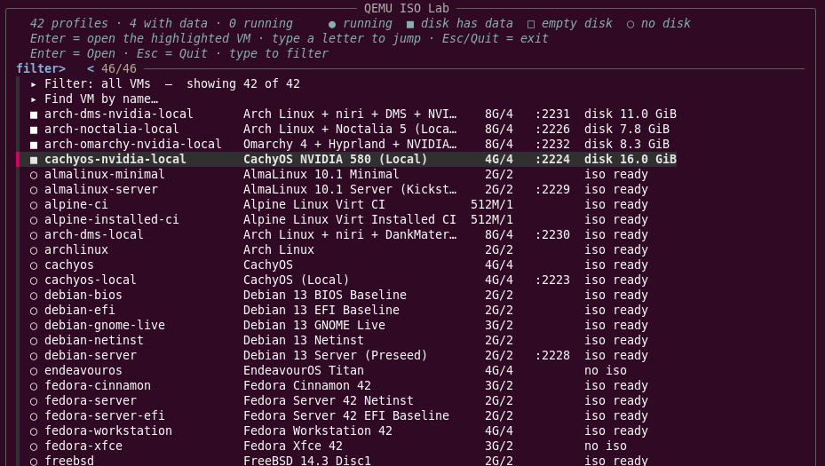
</details>

Keys, video profiles and remote SPICE: [docs/VMTUI.md](docs/VMTUI.md).

## Labs

A lab is a group of VMs on a private network segment, installed and started as one
stack. Each lab gets a generated network map with addresses, port forwards,
logins and a step-by-step runbook.

| Lab | What is in it | Install |
|-----|---------------|---------|
| `netlab` | pfSense router, Pi-hole DNS, Lubuntu desktop client | `vmctl group install netlab` |
| `proxmox-lab` | three Proxmox VE nodes clustered over ZFS mirrors, a Debian client with a browser | `vmctl group install proxmox-lab` |

In the web dashboard, choose **Labs** to see each stack's members, addresses and live state.
Start or stop the stack from its card, or right-click an individual VM for its actions.

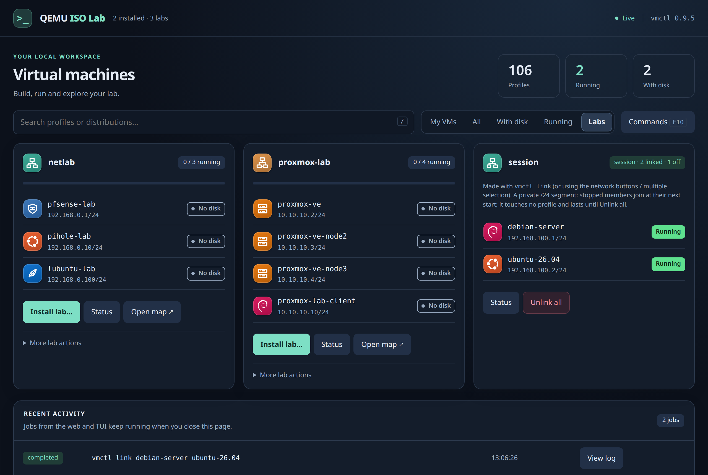

<details>
<summary><b>The generated network map of the Proxmox lab</b></summary>

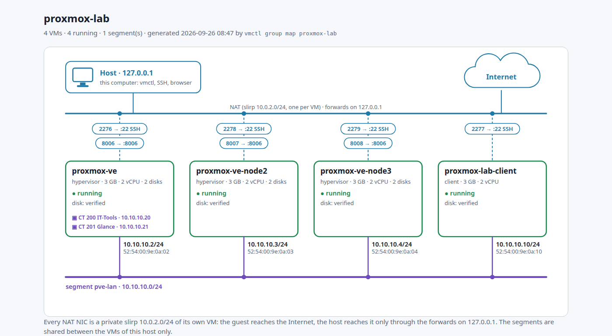
</details>

Members, commands and both maps: [docs/LABS.md](docs/LABS.md).

### Linking any VMs

Any VMs can be put on the same private network on the spot, without editing a profile, so
they can talk to each other:

```bash
vmctl link kali debian-server   # both get a NIC on the session segment (192.168.100.x)
vmctl link --status             # who is linked, with which address
vmctl link --off                # unplug everyone
```

In the web dashboard, click a machine's network button to pick a peer, drag it onto another
machine, or select several VMs (Ctrl/Cmd+click, Shift+click) and choose **Link network**.
A running VM gets a hot-plugged NIC, a stopped one gets it at its next start; Linux, FreeBSD and
Windows 10/11 guests are given their address over SSH. The linked VMs appear under **Labs** as a
*session* lab, with **Status** and **Unlink all**, until you unlink them. Details:
[docs/LABS.md](docs/LABS.md#temporary-links-between-vms-vmctl-link).

## Everyday commands

| I want to... | Run |
|--------------|-----|
| choose my profiles | `vmctl catalog add <vm> [<vm>...]`, `vmctl catalog` |
| see the VMs and their state | `vmctl list`, `vmctl status`, `vmctl show <vm>` |
| boot, enter, stop | `vmctl start <vm>`, `vmctl shell <vm>`, `vmctl stop <vm>` |
| try something and throw it away | `vmctl start <vm> --ephemeral --headless --background`: QEMU `-snapshot`, nothing reaches the disk or the EFI variables (web: *Other ways to start* → *Start ephemeral*; vmtui: *Boot Ephemeral*) |
| watch a headless VM, even mid-install | `vmctl attach <vm>` (screen), `vmctl console <vm>` (serial) |
| record an install as a time-lapse | `vmctl record <vm>` while a bootstrap runs (a 30 s GIF, `--mp4` for the video, under `artifacts/<vm>/recording/`); `check-vms --record` does it for the whole matrix |
| keep a copy to go back to | `vmctl checkpoint create <vm> clean`, later `restore` ([guide](docs/CHECKPOINTS.md)) |
| make an independent second VM | `vmctl clone <vm> <new-name>` ([guide](docs/CLONE.md)) |
| connect two VMs | `vmctl link <vm> <vm>` ([guide](docs/LABS.md)) |
| open a VM in virt-manager | `vmctl export-libvirt <vm>` ([guide](docs/LIBVIRT.md)) |
| write a VM to a USB disk, or import one | `vmctl flash`, `vmctl import-device` ([guide](docs/IMPORT_DISKS.md)) |
| free space | `vmctl clean <vm>`, `vmctl delete-iso <vm>` |

Every command accepts `--dry-run`, and `vmctl --help` lists them all by task.
Tab completion: `echo 'eval "$(vmctl completion zsh)"' >> ~/.zshrc` (bash works too).

## Make it yours

In the web dashboard, select a VM and choose **Customize** (also available by
right-clicking its row). The **Resources** tab sets RAM and vCPUs with presets
(**Use catalog** puts one field back), **Advanced JSON** edits any other field and
**Catalog template** shows the defaults. Changes are validated and saved in
`vms/profiles/local.json`, with a backup; the catalog files stay unchanged.
**Restore all defaults** followed by **Save changes** removes that VM's override.
Resource changes take effect at the next start.

Tracked profiles use a generic guest user, `lab` with password `lab`. Your user
name, SSH key, dotfiles and extra commands go in `vms/profiles/local.json`, which
git ignores and which is merged over every profile; your My VMs selection lives there too:

```bash
make init-local-profile && $EDITOR vms/profiles/local.json
```

Details: [docs/PROVISIONING.md](docs/PROVISIONING.md).

## Documentation

| Page | Read it for |
|------|-------------|
| [Catalog site](https://manzolo.github.io/qemu-iso-lab/) | every profile, its version and history, what to run |
| [Tour](https://manzolo.github.io/qemu-iso-lab/tour.html) ([how it is made](docs/TOUR.md)) | six short clips with English and Italian voice and subtitles |
| [docs/README.md](docs/README.md) | the map of every page, in reading order |
| [PROFILES](docs/PROFILES.md) | the profile model, versions, and how to add a VM |
| [UNATTENDED](docs/UNATTENDED.md) | how each unattended install works, and the validation matrix |
| [PROVISIONING](docs/PROVISIONING.md) | your identity, packages and dotfiles in a fresh guest |
| [VMTUI](docs/VMTUI.md) | the dashboard and the classic menus |
| [FIRST_VM](docs/FIRST_VM.md) ([PDF](docs/FIRST_VM.pdf)) | from `git clone` to a running Ubuntu desktop, every screen of the lifecycle |
| [WEB](docs/WEB.md) | the lab in a browser: actions, jobs, API, safety |
| [LABS](docs/LABS.md) | the network lab, the Proxmox lab and temporary links |
| [guides/](docs/guides/README.md) | printable step-by-step guides in English and Italian (`make guides`) |

## Development

```bash
make check          # mypy --strict + every test (the dashboard's too), before each push
make site           # the catalog site into site/ (GitHub Pages publishes it on push)
make validate-vms   # local only: reinstall every unattended profile, HTML report (hours)
make help           # every developer target
```

The `Makefile` holds developer targets only; anything a user runs is a `vmctl`
subcommand. Tests never touch the host, and CI runs them on Python 3.10 to 3.14.
After editing a tracked profile's recipe, `tools/bump_profile.py <vm> patch|minor|major -m "..."`
records the new version (a test fails otherwise).
More in [docs/DEVELOPMENT.md](docs/DEVELOPMENT.md) and [docs/ARCHITECTURE.md](docs/ARCHITECTURE.md).

## License

[MIT](LICENSE). The software is provided "as is", without warranty of any kind; the authors are not
liable for any damage or data loss arising from its use. Read the warning at the top before using
`vmctl flash` or `vmctl import-device`.

