# From zero to a running VM

Every screen of one complete lifecycle, shot on a clean **Lubuntu 22.04** desktop: clone the
repository, run the setup, open the web dashboard, then **download, install, use, save and stop
an Ubuntu 26.04 desktop VM without typing a single vmctl command**. Each step also gives the
equivalent command, for the terminal or a script.

Times are the ones measured for these screenshots: a Lubuntu VM with 6 vCPUs and 12 GB of RAM,
itself running under KVM, on a fast connection. A physical host is faster.

**Steps:** [1. Get the code](#1-get-the-code) · [2. Set up the host](#2-set-up-the-host) ·
[3. Open the dashboard](#3-open-the-dashboard) · [4. Pick a machine](#4-pick-a-machine) ·
[5. Download the ISO](#5-download-the-iso) · [6. Install it, unattended](#6-install-it-unattended) ·
[7. Watch the install](#7-watch-the-install) · [8. Use the desktop](#8-use-the-desktop) ·
[9. SSH](#9-ssh) · [10. Save it, stop it](#10-save-it-stop-it) · [What is on disk](#what-is-on-disk)

## 1. Get the code

Open a terminal. Only `git` and `python3` are needed; `make` is not.

```bash
mkdir -p ~/lab && cd ~/lab
git clone https://github.com/manzolo/qemu-iso-lab.git && cd qemu-iso-lab
```

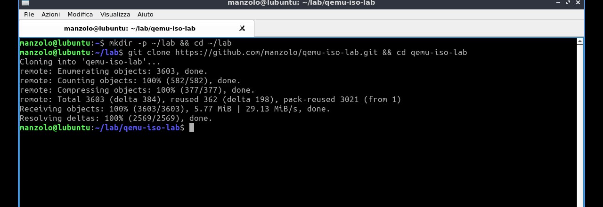

## 2. Set up the host

```bash
./setup.sh
```

It links `vmctl` and `vmtui` into `~/.local/bin`, lists every missing package with the exact
commands it will run, and **asks before running them**. Answer `y`; sudo asks for your password.
QEMU, OVMF, xorriso and the other helpers come from `apt`; the virtiofs daemon, which Ubuntu
22.04 does not package, is the upstream static build in `.tools/`; the Textual dashboard goes
into `.venv-tui` without sudo. About 20 minutes on a fresh system, mostly `apt`.

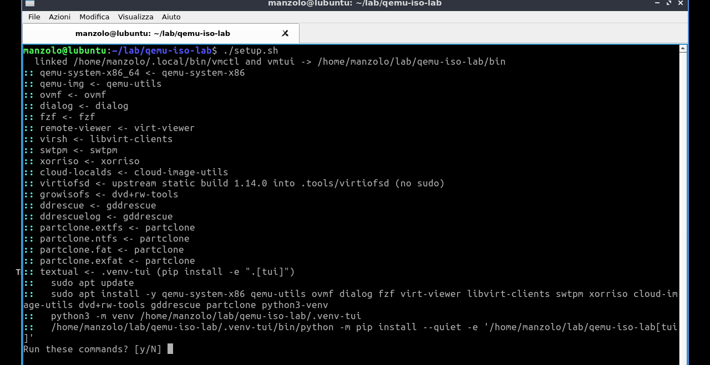

It ends with the host check and a welcome screen with the next commands. Each one is alone on
its line, so a triple-click copies it. On a first run `~/.local/bin` is not on the PATH yet, so
the commands start with `./bin/`. A new login shell fixes that, or the `export` line it shows.


`./bin/vmctl welcome` prints this screen again at any time.

## 3. Open the dashboard

```bash
./bin/vmctl web --open
```

The server listens on **127.0.0.1 only** and prints a URL with a random token; `--open` opens it in
the default browser. Keep the terminal open: Ctrl-C stops the page, never the jobs it started.

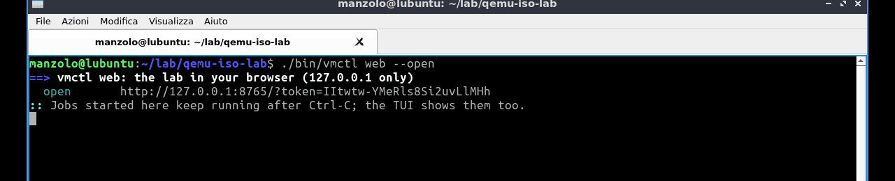

> A fresh Lubuntu 22.04 has no graphical browser: Firefox is a snap that is not installed. Then
> `vmctl web --open` says so. Install one (`sudo snap install firefox`) or open the URL in any browser
> on the same machine.

## 4. Pick a machine

Type in the search box (`/` jumps there) and select a profile. The panel on the right is the
machine: resources, disk, ISO, SSH address, and the actions that make sense **for its current
state**. Right now it has no disk, and the ISO can be downloaded.

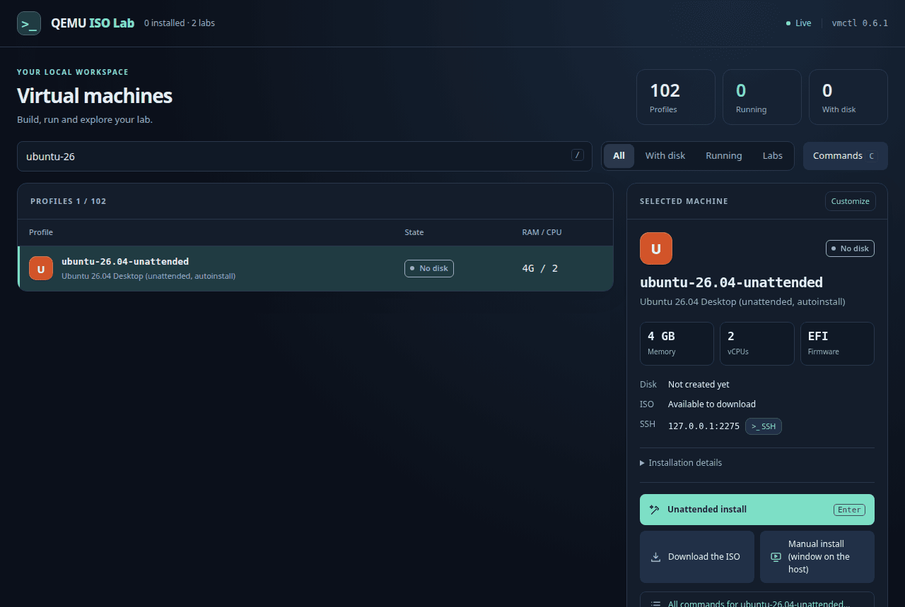

The icons tell the actions apart: green starts or installs, blue looks, amber stops, red deletes.

## 5. Download the ISO

**Download the ISO.** Every action runs as a *job*. Its log opens and follows along live, and
the job keeps running if you close the log, the page or the server. The ISO is downloaded from
the vendor and checked against the profile's pinned checksum.

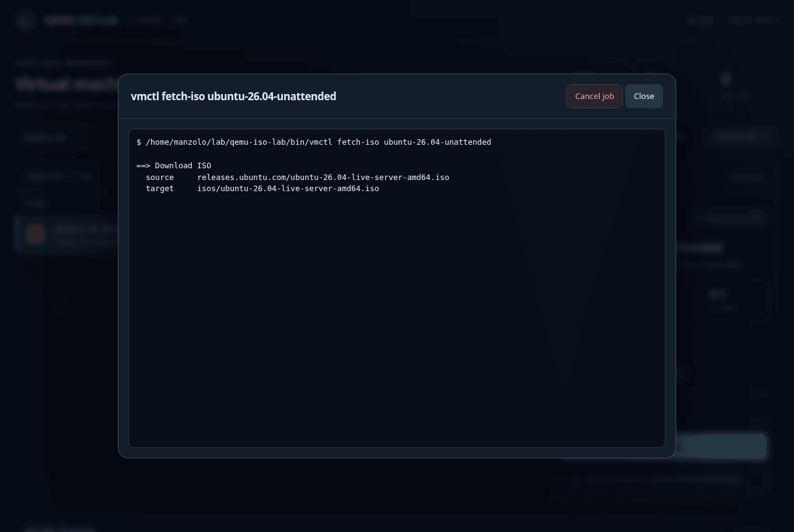

2.9 GB took about a minute here. Afterwards the panel says **ISO: Ready to use**.


Terminal equivalent: `vmctl fetch-iso ubuntu-26.04-unattended`.

## 6. Install it, unattended

**Unattended install** (or Enter). No questions and no clicks. vmctl renders the Ubuntu
autoinstall answers, boots the installer headless, waits for it to finish, starts the new system
and provisions it over SSH with the project's own key.

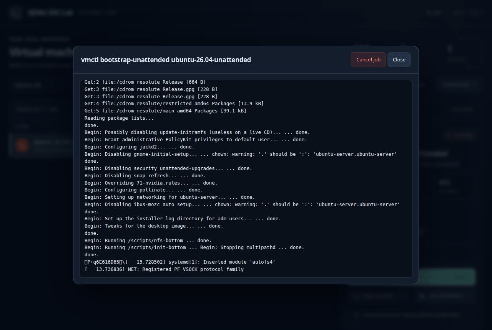

The machine shows **Installing**, and its actions become the ones that make sense during an
install: the log, the console and a screenshot.

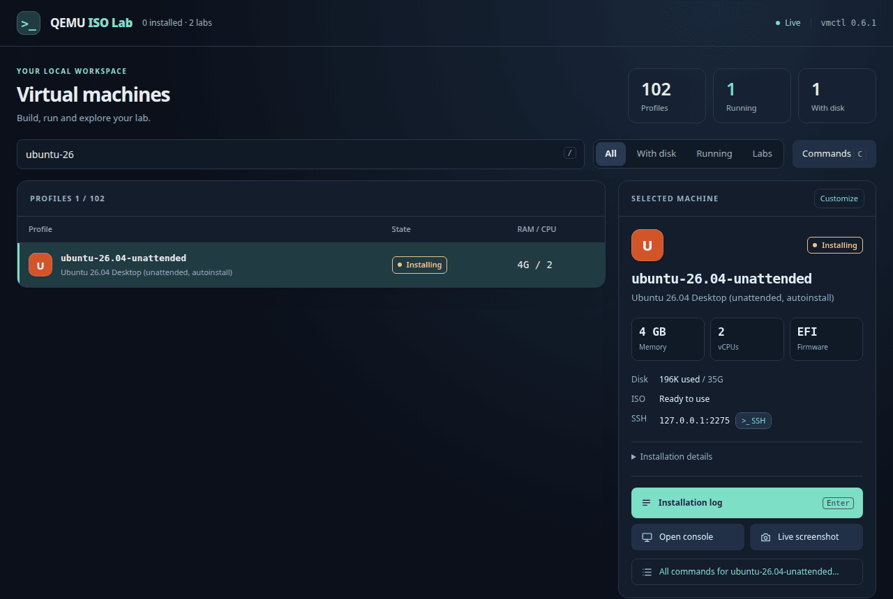

Terminal equivalent: `vmctl bootstrap-unattended ubuntu-26.04-unattended`.

## 7. Watch the install

**Open console** shows the VM's own screen in the page, with keyboard and mouse (noVNC over a
WebSocket to the VM's VNC socket), even while the installer is running headless.


About 15 minutes later the log ends with the checks of the post-install: the desktop session
of user `lab` is active, and the provisioning is complete.

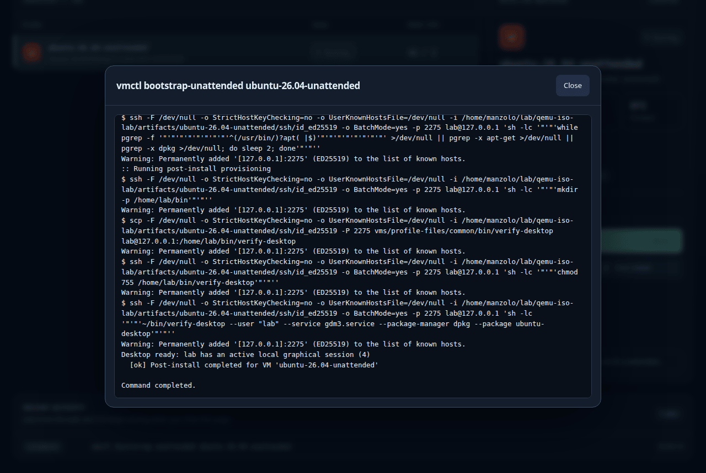

The install leaves the machine **Running**, now with its everyday actions: console, screenshot,
host viewer, Stop, Force stop.

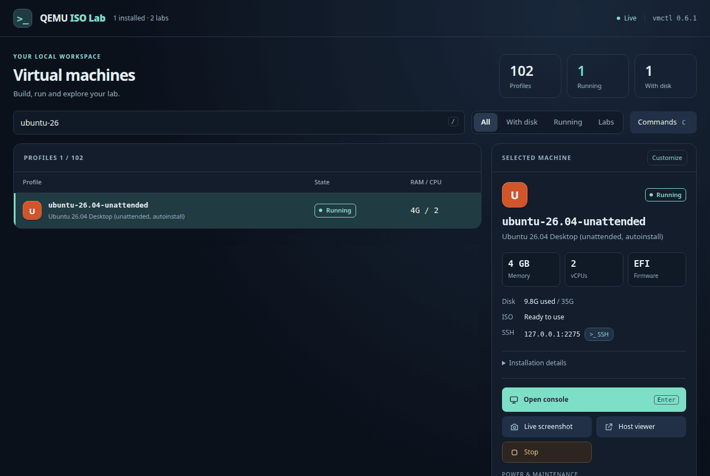

## 8. Use the desktop

**Open console** again: this time it is the Ubuntu 26.04 desktop, logged in automatically.
*Fit to window* / actual size, *Ctrl+Alt+Del* and *Full screen* are in the toolbar. Esc goes to
the VM, and **Close** leaves the console.


Terminal equivalent: `vmctl attach ubuntu-26.04-unattended` (a viewer window on the host).

## 9. SSH

The **>_ SSH** button next to the address offers three ways in, all with the profile's own key
and user: in the browser, in a terminal window on the host, or the command to copy.

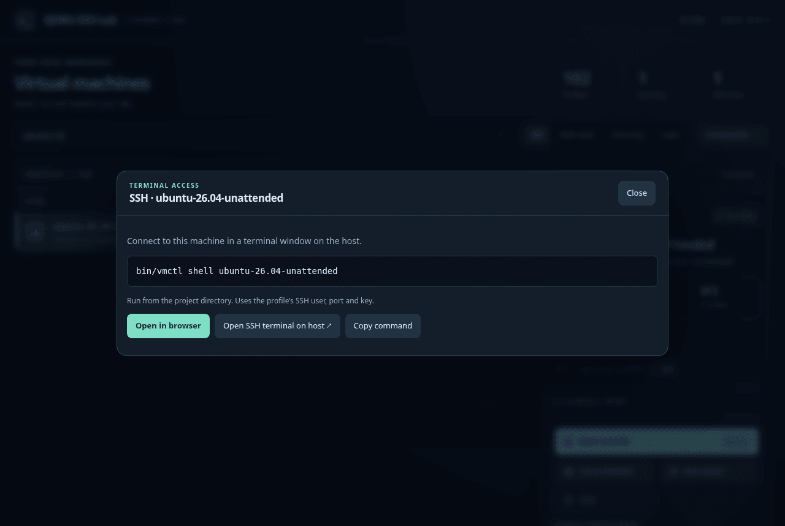

**Open in browser** is an interactive terminal in the page (xterm.js over a PTY). Closing it
ends only the SSH session, never the VM.


**Open SSH terminal on host** opens the same session in a terminal window on the desktop.

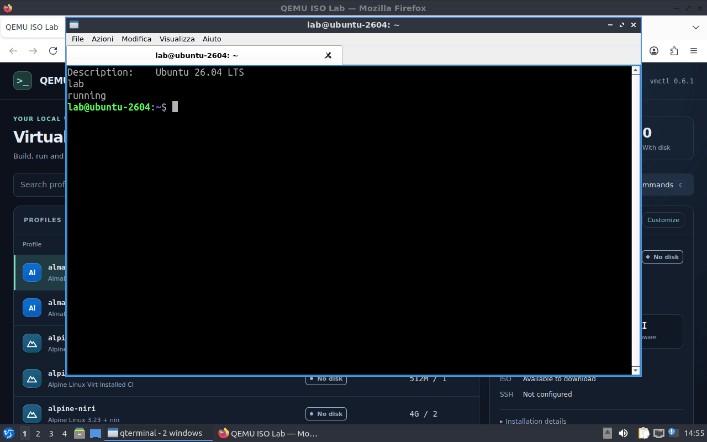

Terminal equivalent: `vmctl shell ubuntu-26.04-unattended`.

## 10. Save it, stop it

Right-click a machine (or Shift+F10) for the same actions anywhere in the list, plus SSH and
**Customize** (RAM, vCPUs and other settings in your own `local.json`; the catalog stays untouched).

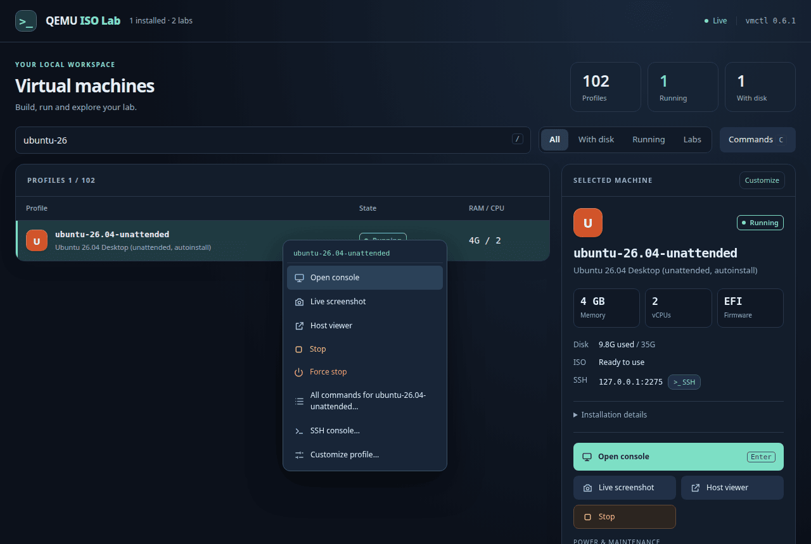

**Stop** asks the guest to power off (guest agent, then ACPI) and waits for it: the disk is
kept.

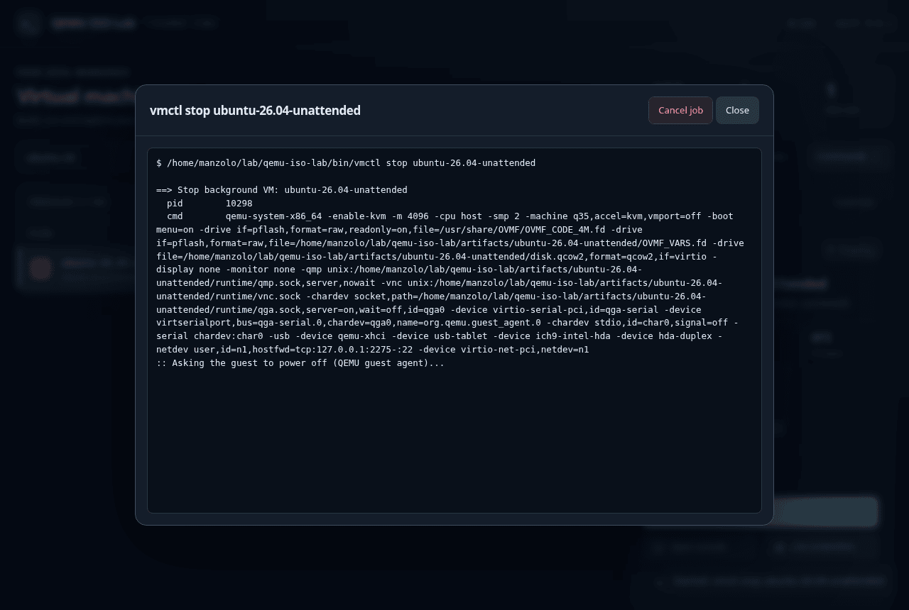

Stopped, the machine is back to **Boot verified**, with its boot actions and **Checkpoint now**.

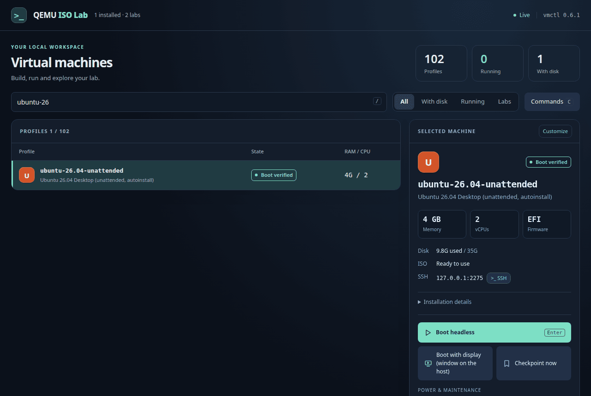

A checkpoint is a full copy of the disk (and of the EFI variables), which `vmctl clean` leaves
alone. Restore it before a risky change, or keep a clean copy.


Terminal equivalents: `vmctl stop ubuntu-26.04-unattended`,
`vmctl checkpoint create ubuntu-26.04-unattended clean`.

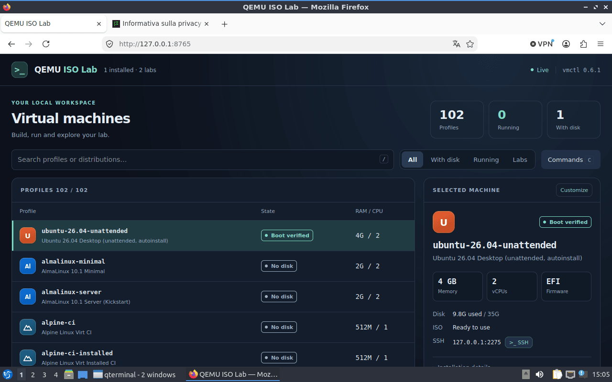

## What is on disk

Everything lives in the repository directory, per machine:

```text
isos/ubuntu-26.04-live-server-amd64.iso      the downloaded, checksummed ISO (shared by profiles)
artifacts/ubuntu-26.04-unattended/
├── disk.qcow2, OVMF_VARS.fd                 the machine's disk and EFI variables
├── ssh/id_ed25519                           the key vmctl shell and the page use
├── logs/                                    installer and serial console logs
├── runtime/tui-job/output.log               the log of the last job (web page and vmtui share it)
├── checkpoints/<name>/                      the checkpoints
└── state.json                               what was installed, when, and whether its boot was verified
```

`vmctl clean ubuntu-26.04-unattended` deletes the disk (checkpoints stay, `--checkpoints` removes
them too). `vmtui` shows the same machines, states and jobs in the terminal, and `vmctl --help`
lists every command.

Next: [the web dashboard in detail](WEB.md) · [labs of several VMs](LABS.md) ·
[unattended flows](UNATTENDED.md) · [your own settings](PROFILES.md)
