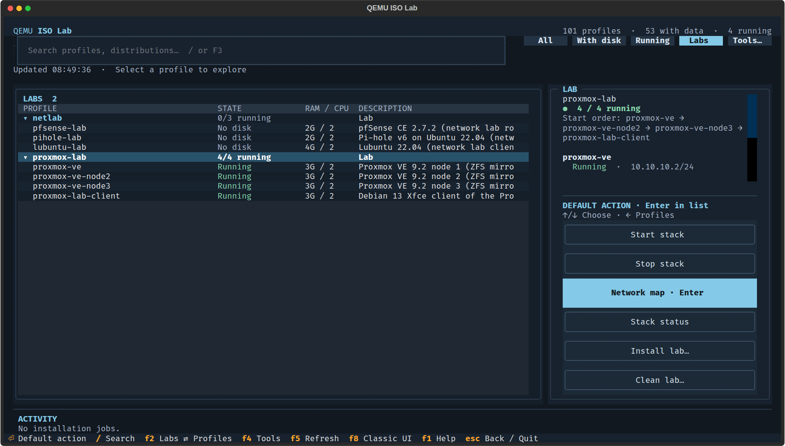
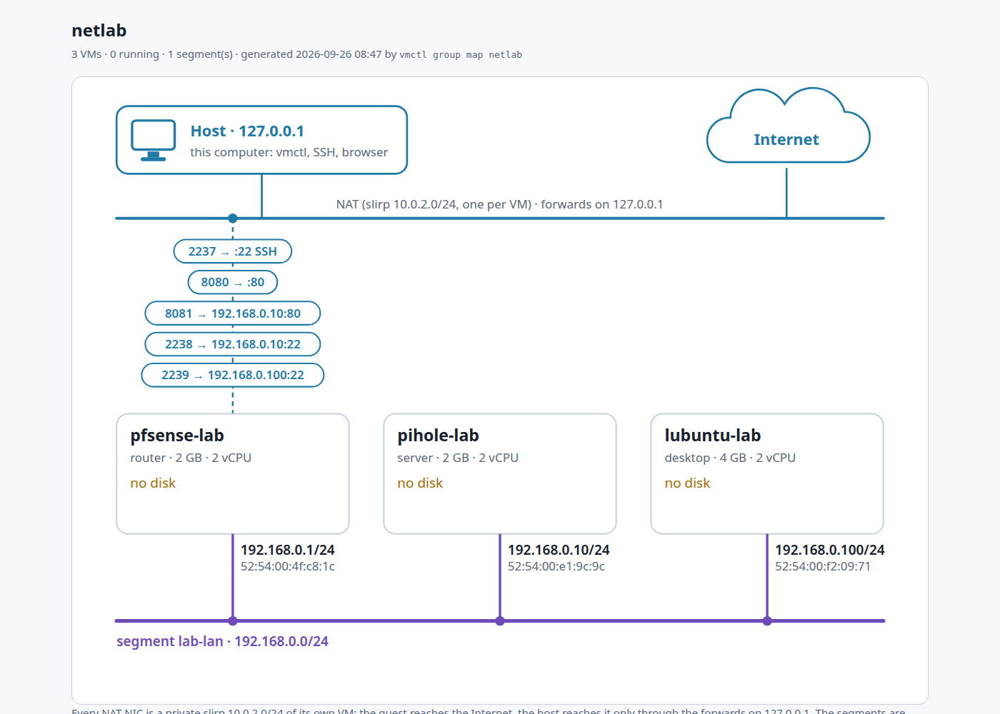

# Labs

A lab is a group of VMs that share a private network segment and work together: a router with
its DNS server and a client, or a three-node Proxmox cluster. Each member is an ordinary profile
with its own unattended install; the lab adds the segment, the start order, the cross-VM step
(the Proxmox cluster) and a network map with how to log in to every member.

| Lab | Members | RAM | Install | Guide |
|---|---|---|---|---|
| `netlab` | pfSense router, Pi-hole DNS, Lubuntu desktop client | ~8 GB | `vmctl group install netlab` | [NETWORK-LAB.md](NETWORK-LAB.md) |
| `proxmox-lab` | three Proxmox VE 9.2 nodes (ZFS mirror, clustered over `pve-lan`), Debian Xfce client with a browser | ~12 GB | `vmctl group install proxmox-lab` | [UNATTENDED.md](UNATTENDED.md#proxmox-ve-bootstrap-proxmox-and-the-proxmox-lab) |

Both are part of the validation matrix: `vmctl check-vms --group netlab` or `--group proxmox-lab`
reinstalls the members from scratch, and for the Proxmox lab also forms the cluster and records it
as one more row (`cluster-pve-lab`).

## In the dashboard

`vmtui`, then **Labs** (or F2): each lab with its members and their state. Enter runs the
suggested step: install what is missing, start the stack, or open its map.



## From the command line

```bash
vmctl group list --labs                 # the labs and their members
vmctl group install proxmox-lab         # install what is missing, start the stack, form the cluster
vmctl group status proxmox-lab          # running / installed, addresses on the segment
vmctl group map proxmox-lab --open      # the network map below, with the Access table and a runbook
vmctl group down proxmox-lab            # stop every member, in reverse start order
vmctl group clean proxmox-lab           # delete the members' disks (asks first; ISOs are kept)
```

## The network map

`vmctl group map <lab>` writes one self-contained HTML page under `artifacts/labs/<lab>/`: the
host, the NAT forwards on 127.0.0.1, every member with its state and the segment with its
addresses. Below the drawing, an **Access** table lists every web GUI, SSH command and login, and
a **runbook** walks through the lab step by step (each block marked *run*, *check* or *try*).




## Going further

- How groups, start order and maps work: [UNATTENDED.md](UNATTENDED.md#groups-as-stacks-and-the-lab-map-vmctl-group).
- The network lab on libvirt instead of plain QEMU: [NETWORK-LAB.md](NETWORK-LAB.md#libvirt-road).
- The next labs (k3s, multi-segment routing, highly available web, Samba AD): [LAB_IDEAS.md](LAB_IDEAS.md).
