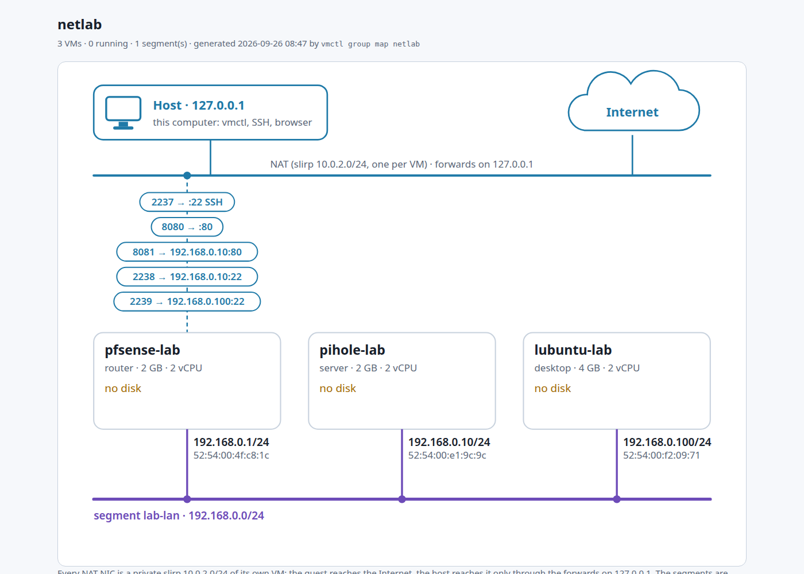

# Labs

A lab is a group of VMs that share a private network segment and work together: a router with
its DNS server and a client, or a three-node Proxmox cluster. Each member is an ordinary profile
with its own unattended install; the lab adds the segment, the start order, the cross-VM step
(the Proxmox cluster) and a network map with how to log in to every member.

| Lab | Members | RAM | Install | Guide |
|---|---|---|---|---|
| `netlab` | pfSense router, Pi-hole DNS, Lubuntu desktop client | ~8 GB | `vmctl group install netlab` | [NETWORK-LAB.md](NETWORK-LAB.md) |
| `proxmox-lab` | three Proxmox VE 9.2 nodes (ZFS mirror, clustered over `pve-lan`), Debian Xfce client with a browser | ~12 GB | `vmctl group install proxmox-lab` | [UNATTENDED.md](UNATTENDED.md#proxmox-ve-bootstrap-proxmox-and-the-proxmox-lab) |

Both are part of the validation matrix: `vmctl check-vms --group netlab` or `--group proxmox-lab`
reinstalls the members from scratch, and for the Proxmox lab also forms the cluster and records it
as one more row (`cluster-pve-lab`).

## In the dashboard

`vmtui`, then **Labs** (or F2): each lab with its members and their state. Enter runs the
suggested step: install what is missing, start the stack, or open its map.


## From the command line

```bash
vmctl group list --labs                 # the labs and their members
vmctl group install proxmox-lab         # install what is missing, start the stack, form the cluster
vmctl group status proxmox-lab          # running / installed, addresses on the segment
vmctl group map proxmox-lab --open      # the network map below, with the Access table and a runbook
vmctl group down proxmox-lab            # stop every member, in reverse start order
vmctl group clean proxmox-lab           # delete the members' disks (asks first; ISOs are kept)
```

## The network map

`vmctl group map <lab>` writes one self-contained HTML page under `artifacts/labs/<lab>/`: the
host, the NAT forwards on 127.0.0.1, every member with its state and the segment with its
addresses. Below the drawing, an **Access** table lists every web GUI, SSH command and login, and
a **runbook** walks through the lab step by step (each block marked *run*, *check* or *try*).




## Temporary links between running VMs (`vmctl link`)

A lab needs profiles that declare a segment. Two machines that are simply running, each on its
own slirp network, cannot see each other — until they are linked:

```bash
vmctl link kali debian-server           # both get a hot-plugged NIC on the "session" segment and a 10.99.0.x address
vmctl link almalinux-server             # one more VM on the same segment
vmctl link                              # who is linked, with the addresses
vmctl link --off                        # unplug everyone (or name the VMs to unplug)
vmctl link a b --segment backend        # a second, separate segment (10.99.<n>.0/24)
```

In the dashboard, **drag a running machine's icon onto another running machine**: the same
command runs after a confirmation, the machine's panel shows a *Linked* row with the address and
its peers (and an *Unlink* button), and the segment appears under **Labs** as a temporary lab
until the machines stop.

What happens: the NIC is added to the running QEMU over QMP (`netdev_add` on the multicast
socket the labs use, `device_add`) with a MAC that is stable per segment and VM; Linux and
FreeBSD guests with SSH get the address set by vmctl (the interface is found by its MAC), other
guests are told which address to set. Nothing is written to the profiles: the record of a segment
is `artifacts/labs/links/<segment>.json`, valid only while the QEMU processes it names run.
Limits: the VMs must be running in the background (*Boot headless*, `vmctl start --headless`),
because only those have a QMP socket; a q35 machine needs the two empty PCIe root ports that
headless boots carry since vmctl 0.9, so a VM booted earlier has to be restarted once; two
segments per VM. For a permanent LAN, declare `networks` in the profiles (Customize) instead.

## Going further

- How groups, start order and maps work: [UNATTENDED.md](UNATTENDED.md#groups-as-stacks-and-the-lab-map-vmctl-group).
- The network lab on libvirt instead of plain QEMU: [NETWORK-LAB.md](NETWORK-LAB.md#libvirt-road).
- The next labs (k3s, multi-segment routing, highly available web, Samba AD): [LAB_IDEAS.md](LAB_IDEAS.md).
