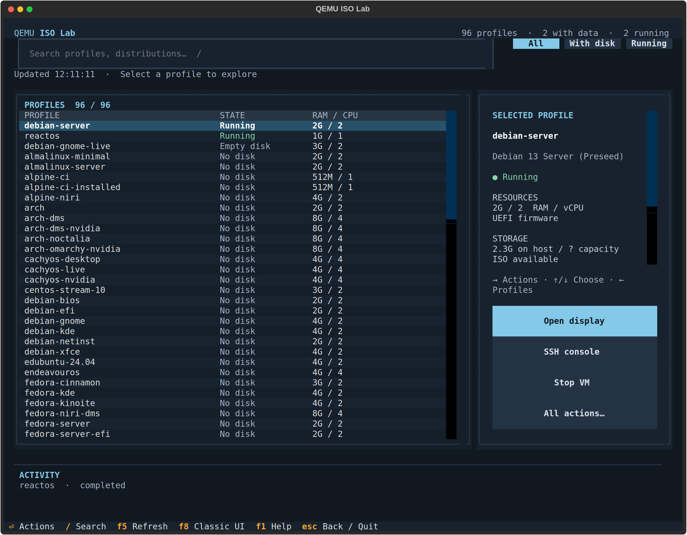
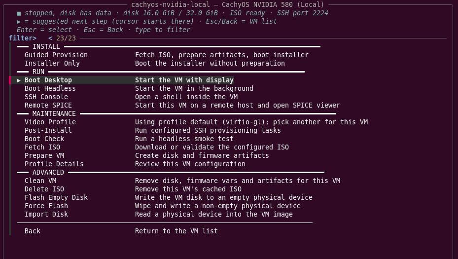

# vmtui

`vmtui` is a terminal dashboard over `vmctl`. It runs the same commands, echoes
each one before executing it, and never holds state the CLI does not have
(except the per-VM video preference described below).



- [Backends](#backends)
- [The dashboard](#the-dashboard)
- [The VM menu](#the-vm-menu)
- [Video profiles](#video-profiles)
- [After an installer](#after-an-installer)
- [Remote SPICE](#remote-spice)
- [Environment variables](#environment-variables)

## Backends

The TUI uses **fzf** when installed (fuzzy type-to-filter, cursor on the
suggested entry, version 0.36 or newer) and falls back to **dialog** otherwise.
Force one with `VMTUI_UI=fzf` or `VMTUI_UI=dialog`.

## The dashboard

The main screen lists every profile with live state:

| Glyph | Meaning |
|-------|---------|
| `●` | running |
| `■` | stopped, disk has data (an OS is installed) |
| `□` | disk prepared but still empty |
| `○` | no disk |

Each row also shows RAM/CPU, the SSH host port and the disk size or ISO state.
Installed VMs are listed first and the cursor starts on the VM you opened last.
The header counts profiles, VMs with data and running VMs.

Above the list: `Filter` (all / installed / running / by distro family) and
`Find` (substring on name or title). Below it: `Tools` (`vmctl status`, remote
hosts, clean all) and `Quit`. Esc or Ctrl-C from anywhere returns to the
previous screen instead of leaving the TUI.

## The VM menu



Opening a VM shows a one-line state summary
(`■ stopped, disk has data · disk 16.0 GiB / 32.0 GiB · ISO ready · SSH port 2224`)
and a single contextual menu. Only actions that make sense for the VM right now
are listed, and the suggested next step is marked `▶` and preselected, so Enter
does the obvious thing: install when there is no disk, boot when it is stopped,
SSH when it is running.

| Section | Entries |
|---------|---------|
| INSTALL | The install flow matching the profile: `Full Bootstrap`, `Omarchy Bootstrap`, `Arch Bootstrap`, `Arch Install (Interactive)`, `Debian Preseed Bootstrap`, `Kickstart Bootstrap`, `Unattended Install`, `Cloud-Init Flow`, `Seeded Installer`, `Guided Provision`, `Installer Only` |
| RUN | `Boot Desktop`, `Boot Headless`, `Stop VM` (only while running), `SSH Console` (only with SSH provisioning, also while an installer is running on an empty disk), `First Boot` (cloud-init), `Remote SPICE` |
| MAINTENANCE | `Video Profile`, `Post-Install`, `Boot Check`, `Fetch ISO`, `Prepare VM`, `Profile Details` |
| ADVANCED | `Clean VM`, `Delete ISO`, `Flash Empty Disk`, `Force Flash`, `Import Disk` |
| | `Back` (or Esc) returns to the dashboard |

Destructive actions (`Stop VM`, `Clean VM`, `Delete ISO`, flash and import) ask
for confirmation; flash and import also require typing the device path.

## Video profiles

`Video Profile` picks the `video.variants` entry used by every start and install
action of that VM and remembers it under `~/.local/state/vmtui/`, so the TUI
never asks again until you change it. The current choice is shown in the menu
entry itself.

## After an installer

After an installer that does not auto-boot the VM (`Unattended Install`,
`Guided Provision`, `Cloud-Init Flow`, `Arch Install (Interactive)`,
`Installer Only`, `Seeded Installer`) the TUI offers
`Start headless + SSH post-install` / `Start with display` / `Done`, so the
install, boot and post-install chain finishes without navigating back through
menus. The full-flow `Bootstrap` actions already do this end to end and skip
the prompt.

## Remote SPICE

To run a VM on another machine and view it locally, create a remote host config:

```bash
cp vms/remotes.json.example vms/remotes.json
```

Edit it with the SSH target, the remote project path and the SPICE ports; the
TUI can also create and edit this file from `Remote Hosts` under `Tools`. Then
pick `Remote SPICE` in a VM menu: the TUI starts QEMU on the remote host with
`--spice-port`, opens an SSH tunnel and launches `remote-viewer` locally. If
`remote-viewer` is missing, it offers to install `virt-viewer` with the detected
package manager.

## Environment variables

| Variable | Effect |
|----------|--------|
| `VMTUI_UI` | `fzf` or `dialog`, skips auto-detection |
| `VMTUI_ROOT_DIR` | Repository root (default: resolved from the script location) |
| `VMTUI_CONFIG_DIR` | Directory holding `profiles/` and `remotes.json` (default: `<root>/vms`) |
| `VMTUI_STATE_DIR` | Where video preferences are stored (default: `~/.local/state/vmtui`) |
